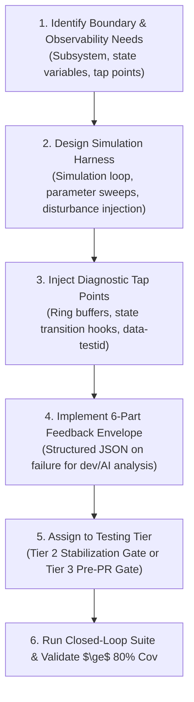

# 🧪 Simulation & Control Harness Builder for Developers and AI (`test-harness-builder`)

Use this skill when introducing a new API boundary, algorithmic module, state machine, dynamic subsystem, or frontend UI that requires rigorous closed-loop verification and observability.

This skill equips both **human engineers** and **AI agents** to treat software as an observable dynamic system with state introspection, stress simulation, and deterministic error reproduction.

---

## 🎯 Harness Generation Workflow

---

## 📋 Interactive Setup Protocol

When invoked, the agent engages in proactive questioning to configure the harness:
1. **Target Component / System Boundary**: *"What specific subsystem, dynamic system, API boundary, or algorithm do you want to observe and control?"*
2. **Diagnostic Tap Points & Observability**: *"What internal state transitions, in-memory ring buffers, or UI `data-testid` anchors do developers and AI need to tap into?"*
3. **Simulation Loop & Parameter Sweeps**: *"What throughput target, iteration volume, or parameter sweep space (e.g. 500 iterations, 50 concurrent streams) should the simulation run?"*
4. **Disturbance Injection Modes**: *"What failure modes should we inject (e.g. abrupt socket disconnects, malformed payloads, latency spikes, cancellation storms)?"*
5. **Testing Tier & Gate Cadence**: *"Is this harness intended as a Tier 2 stabilization gate before manual testing or a Tier 3 Pre-PR / Pre-Release CI gate?"*

---

## 🛠️ Artifacts Generated

### 1. High-Volume Simulation Harness & Parameter Sweeps
- **Backend / Services**: High-throughput execution loops measuring throughput, memory stability, and state convergence across parameterized sweeps.
- **Transports**: Synthetic child process STDIO (`mock_stdio.js`) or stream injectors.

### 2. Disturbance Injection Suite
- Configurable synthetic disturbance triggers:
  - Abrupt process / socket disconnects and reconnection recovery.
  - Malformed or partial payload injection.
  - Injected latency spikes and timeout stress.
  - Clean `CancellationToken` teardown verification.

### 3. Diagnostic Tap Points
- **In-Memory Ring Buffers**: Temporary or toggleable ring-buffer state getters (`DiagnosticTapRingBuffer`) capturing internal state transitions without polluting production logs.
- **Introspection Endpoints**: Debug tap points enabling developer and AI agent inspection during active execution.

### 4. Frontend Playwright Driver & Layout Audit
- Injects standard `data-testid` attributes on interactive components.
- Generates `tests/e2e/layout-audit.spec.ts` running the 4-point `playwright-layout-inspector` suite:
  - Zero horizontal overflow
  - Mobile viewport fit
  - Touch target ergonomics ($\ge 24$px)
  - Composite UX audit score ($\ge 85$)

### 5. Standardized 6-Part Feedback Envelope
Generates failure formatting containing:
- `inputs` & `assumptions`
- `active_settings`
- `action_history` (state transitions)
- `output_delta` (expected vs actual)
- `captured_logs`
- `reproduction_command`
