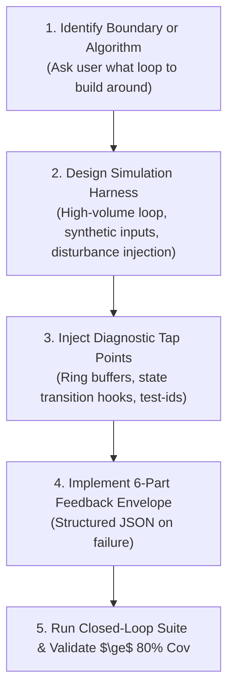

# 🧪 Test Harness & Simulation Builder Skill (`test-harness-builder`)

Use this skill when introducing a new API boundary, algorithmic module, state machine, or frontend UI that requires rigorous closed-loop verification.

---

## 🎯 Harness Generation Workflow

---

## 📋 Interactive Setup Protocol

When invoked, the agent asks:
1. **Target Component / Boundary**: *"What specific subsystem, API boundary, or algorithm do you want to build a loop around?"*
2. **Stress & Volume Parameters**: *"What batch size / throughput target should we stress (e.g. 500 items, 50 concurrent streams)?"*
3. **Disturbance Modes**: *"Do we need malformed payload ingestion, simulated abrupt disconnects, or cancellation stress?"*

---

## 🛠️ Artifacts Generated

### 1. High-Volume Simulation Harness
- **Backend / Services**: High-throughput execution loops measuring throughput, memory stability, and state convergence.
- **Transports**: Synthetic child process STDIO (`mock_stdio.js`) or stream injectors.

### 2. Frontend Playwright Driver
- Injects `data-testid` attributes on interactive components.
- Generates `tests/e2e/layout-audit.spec.ts` running the 4-point `playwright-layout-inspector` suite.

### 3. Diagnostic Tap Points
- Injects temporary event-driven diagnostic hooks or ring-buffer state getters to observe internal state transitions during test execution.

### 4. 6-Part Agent Feedback Envelope
Generates failure formatting containing:
- `inputs` & `assumptions`
- `active_settings`
- `action_history` (state transitions)
- `output_delta` (expected vs actual)
- `captured_logs`
- `reproduction_command`
