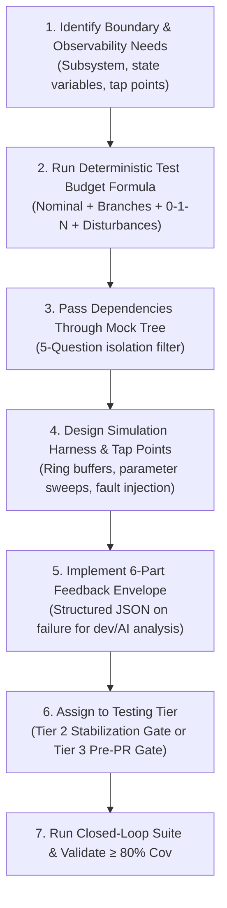
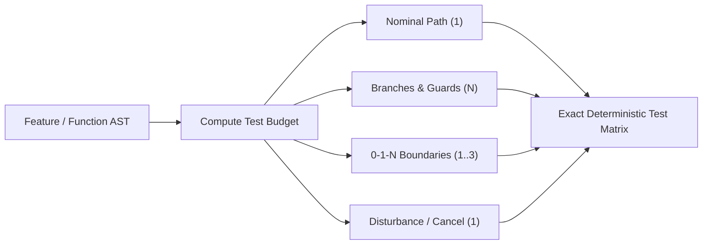
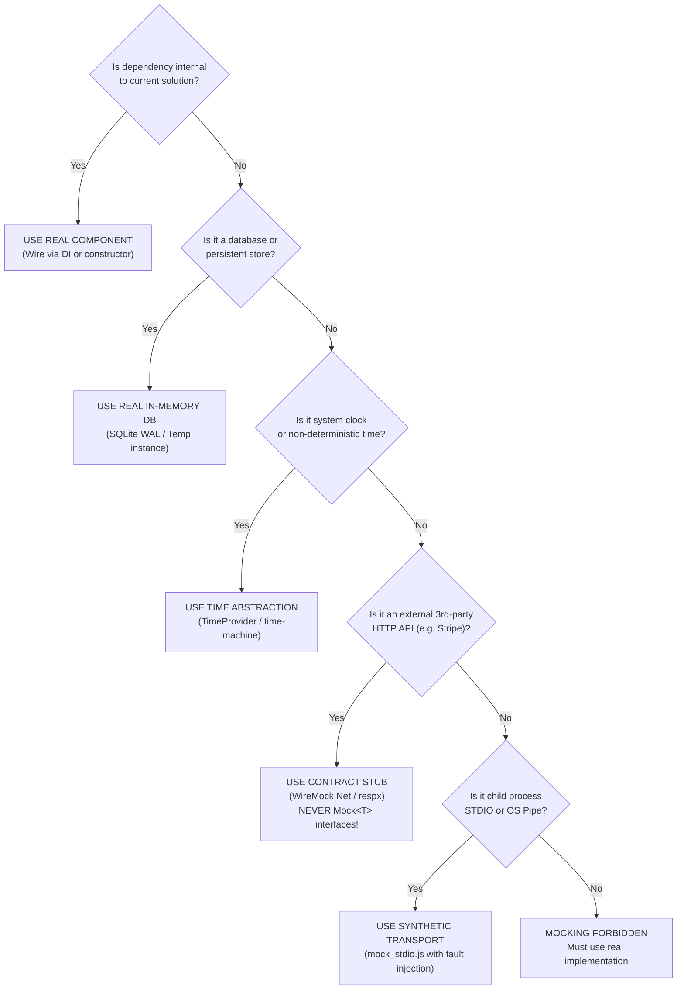

# 🧪 Simulation & Control Harness Builder for Developers and AI (`test-harness-builder`)

Use this skill when introducing a new API boundary, algorithmic module, state machine, dynamic subsystem, or frontend UI that requires rigorous closed-loop verification and observability.

This skill equips human engineers and AI agents to treat software as an observable dynamic system with state introspection and stress simulation.

---

## 🎯 Harness Generation Workflow

```mermaid
flowchart TD
    Identify["1. Identify Boundary & Observability Needs<br>(Subsystem, state variables, tap points)"] --> Budget["2. Run Deterministic Test Budget Formula<br>(Nominal + Branches + 0-1-N + Disturbances)"]
    Budget --> MockTree["3. Pass Dependencies Through Mock Tree<br>(5-Question isolation filter)"]
    MockTree --> Design["4. Design Simulation Harness & Tap Points<br>(Ring buffers, parameter sweeps, fault injection)"]
    Design --> Envelope["5. Implement 6-Part Feedback Envelope<br>(Structured JSON on failure for dev/AI analysis)"]
    Envelope --> Cadence["6. Assign to Testing Tier<br>(Tier 2 Stabilization Gate or Tier 3 Pre-PR Gate)"]
    Cadence --> Verify["7. Run Closed-Loop Suite & Validate &ge; 80% Cov"]
```

---

## 📋 Mandatory Pre-Authoring Checklist

Execute these mandatory checks before writing any test or harness code:

### 1. Run Deterministic Test Budget Formula
Analyze the target code Abstract Syntax Tree (AST) or specification. Calculate the exact test budget:

$$\text{Test Budget} = \text{Nominal (1)} + N_{\text{Branches}} + N_{\text{0-1-N Boundaries}} + N_{\text{Disturbances}}$$

1. **Nominal Path ($= 1$)**: Author exactly one test for the happy path with valid data.
2. **Decision & Guard Branches ($= N_{\text{Branches}}$)**: Author exactly one test per branch (`if`, `switch`, guard clause, explicit `throw`).
3. **0-1-N Boundary Conditions ($= 1 \text{ to } 3$)**:
   - `0`: Test empty collections, null parameters, or zero values.
   - `1`: Test single elements or minimum boundary thresholds.
   - `N`: Test large collections, maximum limits, or pagination boundaries.
4. **Disturbances / Lifecycle ($= 1$ if async or I/O)**:
   - For async routines: test `CancellationToken` cancellation and timeout recovery.
   - For state mutations: test idempotency under repeated calls.

```mermaid
flowchart LR
    AST["Feature / Function AST"] --> Calc["Compute Test Budget"]
    Calc --> T1["Nominal Path (1)"]
    Calc --> T2["Branches & Guards (N)"]
    Calc --> T3["0-1-N Boundaries (1..3)"]
    Calc --> T4["Disturbance / Cancel (1)"]
    T1 & T2 & T3 & T4 --> CompleteSuite["Exact Deterministic Test Matrix"]
```

### 2. Pass Dependencies Through 5-Question Mock Decision Tree
Pass every collaborator through the 5-question tree before adding any mock or stub:

1. **Is the dependency internal to the current solution?**
   - If yes: **Use the real component**. Wire it through dependency injection or direct instantiation.
2. **Is it a database or persistent store?**
   - If yes: **Use a real in-memory database** (SQLite in WAL mode or ephemeral test instance).
3. **Is it system clock or non-deterministic time?**
   - If yes: **Use a time abstraction** (`TimeProvider` or time-machine).
4. **Is it an external 3rd-party HTTP API (e.g., Stripe, SendGrid)?**
   - If yes: **Use a contract stub** (`WireMock.Net` or `respx`). Never mock internal interfaces!
5. **Is it child process STDIO or an OS pipe?**
   - If yes: **Use synthetic transport** (`mock_stdio.js`) with fault injection.
- If you answer "No" to all five questions, **mocking is forbidden**. Use the real implementation.

```mermaid
flowchart TD
    Q1{"Is dependency internal<br/>to current solution?"}
    Q1 -- Yes --> UseDI["USE REAL COMPONENT<br/>(Wire via DI or constructor)"]
    Q1 -- No --> Q2{"Is it a database or<br/>persistent store?"}
    
    Q2 -- Yes --> UseDB["USE REAL IN-MEMORY DB<br/>(SQLite WAL / Temp instance)"]
    Q2 -- No --> Q3{"Is it system clock<br/>or non-deterministic time?"}
    
    Q3 -- Yes --> UseTime["USE TIME ABSTRACTION<br/>(TimeProvider / time-machine)"]
    Q3 -- No --> Q4{"Is it an external 3rd-party<br/>HTTP API (e.g. Stripe)?"}
    
    Q4 -- Yes --> UseWireMock["USE CONTRACT STUB<br/>(WireMock.Net / respx)<br/>NEVER Mock&lt;T&gt; interfaces!"]
    Q4 -- No --> Q5{"Is it child process<br/>STDIO or OS Pipe?"}
    
    Q5 -- Yes --> UseSynth["USE SYNTHETIC TRANSPORT<br/>(mock_stdio.js with fault injection)"]
    Q5 -- No --> Banned["MOCKING FORBIDDEN<br/>Must use real implementation"]
```

---

## 🚫 Anti-Test-Theatre Guardrails

Never author test theatre. Test theatre asserts mock interactions rather than real system behaviors.

| Dimension | 🚫 Banned Anti-Pattern (Test Theatre) | ✅ Mandated Engineering Standard (Real Verification) |
| :--- | :--- | :--- |
| **1. Data Access & Persistence** | • Mocking `IRepository<T>` or `DbContext` to return static arrays. • Asserting that `ExecuteAsync` received a specific SQL string. • Ignoring real constraints (foreign keys, nullability, unique indexes). | • Execute real Dapper queries and migrations against an in-memory SQLite (WAL mode) database. • Assert database state transitions directly (insert, mutate, query back, verify constraints). |
| **2. Service Wiring & Composition** | • Constructing classes with many mocked constructor parameters. • Verifying internal method call chains rather than component behavior. | • Wire real dependencies through the application DI container. • Exercise aggregate workflows end-to-end; verify system state deltas. |
| **3. Assertion Quality & Semantics** | • Asserting mock invocations (`mock.Verify`) as sole proof of success. • Vague assertions (`Assert.NotNull`, `len > 0`, `status != 500`). • Tautological assertions that use test helpers matching system bugs. | • Assert concrete state and schema invariants (`Assert.Equal`, exact payload diffs). • Use 6-part feedback envelopes to capture exact `output_delta` on failure. • Verify observable side effects (emitted events, committed rows). |
| **4. HTTP & Web APIs** | • Instantiating controller classes directly with mocked dependencies. • Mocking middleware, authentication filters, or model validation. • Skipping JSON serialization roundtrips. | • Execute full HTTP roundtrips via `WebApplicationFactory` or `httpx.AsyncClient`. • Validate through routing, model binding, auth handlers, and serializers. |
| **5. CLI & Console Applications** | • Mocking `Console.ReadLine` or `sys.stdin` with fake memory streams. • Asserting exit code 0 without inspecting output files or state. | • Execute real CLI binaries via subprocess execution against temporary workspace fixtures. • Assert exact exit codes, stdout/stderr formatting, and filesystem changes. |
| **6. Async, Channels & Daemons** | • Using arbitrary sleep statements (`Thread.Sleep`, `asyncio.sleep`) to wait for background workers. • Mocking `Channel<T>` or workers out of the test loop. | • Use deterministic synchronization (`WaitToReadAsync`, `ManualResetEventSlim`, or polling with timeout). • Drain in-memory queues and verify worker processing, retry, and cancellation. |
| **7. Error Handling & Fault Injection** | • Writing happy-path-only tests without simulating failures. • Forcing mocks to throw generic exceptions unrepresentative of reality. | • Inject synthetic disturbances: malformed payloads, abrupt termination, socket timeouts, invalid tokens. • Verify graceful degradation, standardized error payloads, and audit logs. |
| **8. Test Data & Fixtures** | • Randomly generated test data causing non-deterministic flaky failures. • Massive, fragile 1,000-line JSON fixtures with mostly unused fields. | • Use deterministic test data builders with explicit random seeds. • Specify only fields relevant to the test scenario; use valid domain defaults. |
| **9. Trivial & Boilerplate Testing** | • Testing auto-implemented properties, records, DTOs, or enum mappings to boost coverage metrics. • Writing many tests for trivial pass-through routines. | • Do not write tests for boilerplate POCOs, DTOs, or auto-properties. • Focus test budgets strictly on domain logic, edge cases, and integration boundaries. |
| **10. UI & Frontend Verification** | • Shallow unit testing of components where all child components and hooks are mocked to empty divs. • Snapshot testing large DOM trees that developers blindly accept. | • Run Playwright E2E journey tests against running frontend and backend instances. • Enforce the 4-point `playwright-layout-inspector` audit (no overflow, mobile fit, &ge; 24px targets, score &ge; 85). |
| **11. Configuration & Environments** | • Hardcoding environment variables or mocking `IConfiguration` with fake dictionaries. • Tests that fail on different machines due to absolute local paths. | • Test configuration binding using real settings loading with temporary isolated environment overlays. • Verify fallback behavior when required configuration keys are absent or invalid. |
| **12. Third-Party Network Boundaries** | • Mocking third-party APIs with hand-rolled mock behaviors that drift from real contracts. • Making live outbound network requests during automated tests. | • Use WireMock (.NET) or `respx` / `vcrpy` (Python) to replay recorded HTTP interactions. • Restrict mocking strictly to external network edges; never mock internal boundaries. |

---

## 📋 Interactive Setup Protocol

When invoked, the agent engages in proactive questioning to configure the harness:
1. **Target Component / System Boundary**: *"What specific subsystem, dynamic system, API boundary, or algorithm do you want to observe and control?"*
2. **Deterministic Test Budget & AST Branches**: *"How many decision branches, 0-1-N boundary conditions, and disturbance paths exist in this component?"*
3. **Collaborators & 5-Question Mock Evaluation**: *"What collaborators does this component depend on, and how does each pass the 5-Question Mock Decision Tree?"*
4. **Diagnostic Tap Points & Observability**: *"What internal state transitions, in-memory ring buffers, or UI `data-testid` anchors do developers and AI need to tap into?"*
5. **Simulation Loop & Parameter Sweeps**: *"What throughput target, iteration volume, or parameter sweep space (e.g. 500 iterations, 50 concurrent streams) should the simulation run?"*
6. **Disturbance Injection Modes**: *"What failure modes should we inject (e.g. abrupt socket disconnects, malformed payloads, latency spikes, cancellation storms)?"*
7. **Testing Tier & Gate Cadence**: *"Is this harness a Tier 2 stabilization gate before manual testing or a Tier 3 Pre-PR CI gate?"*

---

## 🛠️ Artifacts Generated

### 1. High-Volume Simulation Harness & Parameter Sweeps
- **Backend / Services**: High-throughput execution loops measuring throughput, memory stability, and state convergence across parameterized sweeps.
- **Transports**: Synthetic child process STDIO (`mock_stdio.js`) or stream injectors.

### 2. Disturbance Injection Suite
- Configurable synthetic disturbance triggers:
  - Abrupt process / socket disconnects and reconnection recovery.
  - Malformed or partial payload injection.
  - Injected latency spikes and timeout stress.
  - Clean `CancellationToken` teardown verification.

### 3. Diagnostic Tap Points
- **In-Memory Ring Buffers**: Temporary or toggleable ring-buffer state getters (`DiagnosticTapRingBuffer`) capturing internal state transitions without polluting production logs.
- **Introspection Endpoints**: Debug tap points enabling developer and AI agent inspection during active execution.

### 4. Frontend Playwright Driver & Layout Audit
- Injects standard `data-testid` attributes on interactive components.
- Generates `tests/e2e/layout-audit.spec.ts` running the 4-point `playwright-layout-inspector` suite:
  - Zero horizontal overflow
  - Mobile viewport fit
  - Touch target ergonomics ($\ge 24$px)
  - Composite UX audit score ($\ge 85$)

### 5. Standardized 6-Part Feedback Envelope
Generates failure formatting containing:
- `inputs` & `assumptions`
- `active_settings`
- `action_history` (state transitions)
- `output_delta` (expected vs actual)
- `captured_logs`
- `reproduction_command`

### 6. Representative Integration Fixtures
- **Web API**: Real `WebApplicationFactory` (.NET) or `httpx.AsyncClient` (Python) fixtures binding in-memory SQLite (WAL mode).
- **CLI Commands**: Subprocess test runners executing binaries in isolated temporary directories.
- **Contract Stubs**: WireMock.Net or `respx` recorded stubs for third-party HTTP endpoints.
