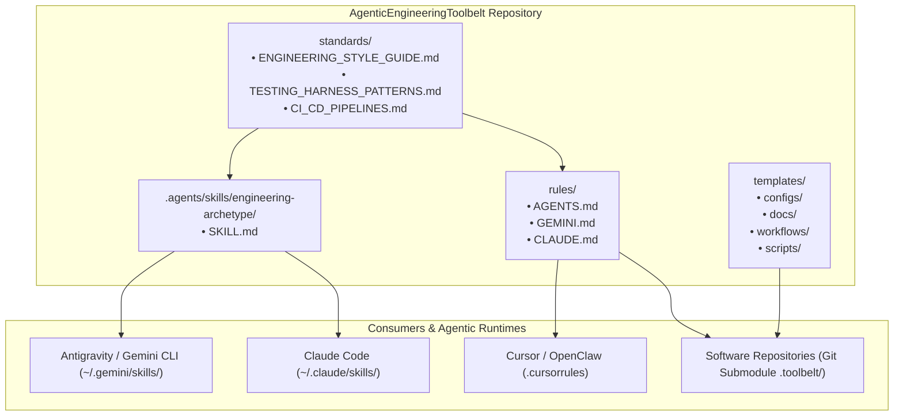

# 🏛️ Architecture: AgenticEngineeringToolbelt

This document explains the organization, design principles, and consumption models of **AgenticEngineeringToolbelt**.

---

## 🏗️ System Overview & Consumption Topology

---

## 🧩 Subsystem Breakdown

### 1. `standards/`
Canonical reference specifications for software design:
- `ENGINEERING_STYLE_GUIDE.md`: The definitive guide for C# .NET Minimal APIs/Controllers, Dapper/Stored Procedures, React 19 + TypeScript + Zustand + Vite, and SOLID/DRY design.
- `TESTING_HARNESS_PATTERNS.md`: Methodology for controls, simulation, and closed-loop testing (>80% code coverage target).
- `CI_CD_PIPELINES.md`: 4-stage GitHub Actions quality gate specification.

### 2. `.agents/skills/`
Executable skill manifests compatible with agent skill registries (Antigravity, Claude Code, etc.):
- `engineering-archetype/SKILL.md`: Instructs the agent on how to collaborate with Steven, prototype features, ask clarifying questions, implement code, and verify builds.

### 3. `rules/`
Drop-in prompt rule files:
- `AGENTS.md`: Universal markdown rules for any repository root.
- `GEMINI.md`: Antigravity / Gemini specific context rules.
- `CLAUDE.md`: Claude Code context rules.

### 4. `templates/`
Generic configuration boilerplates and automation scripts:
- `configs/`: `Directory.Build.props`, `vite.config.ts`, `tsconfig.json`, `eslint.config.js`, `playwright.config.ts`.
- `docs/`: Starter `ARCHITECTURE.md` (with Mermaid templates), `REQUIREMENTS.md`, `CHANGELOG.md`.
- `workflows/`: `ci.yml`, `codeql.yml`, `release.yml`.
- `scripts/`: `commit.sh` (atomic build & version bump) and `verify_release.py` (markdown link & version auditor).

---

## 📐 Non-Functional Guarantees

1. **Zero External Runtime Dependencies**: The toolbelt consists of portable Markdown, YAML, Shell, Python, and JSON configuration files.
2. **Submodule Safety**: Does not contain hardcoded absolute filesystem paths; all references are relative or template placeholders.
3. **Multi-Agent Interoperability**: Formatted to be recognized natively by Antigravity, Claude Code, Cursor, Codex, and custom MCP router gateways.
