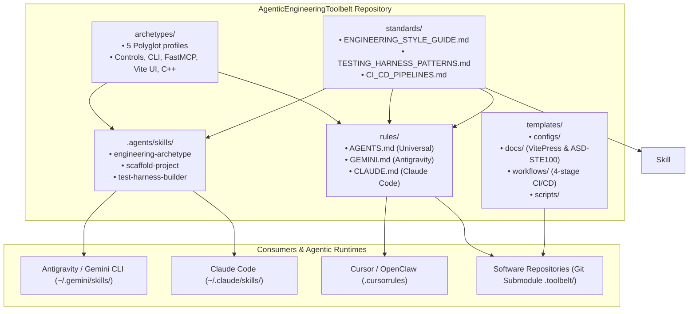
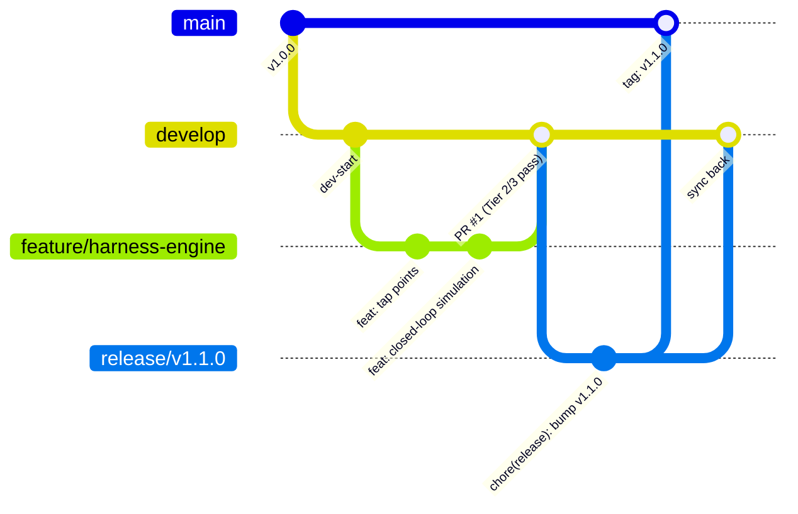
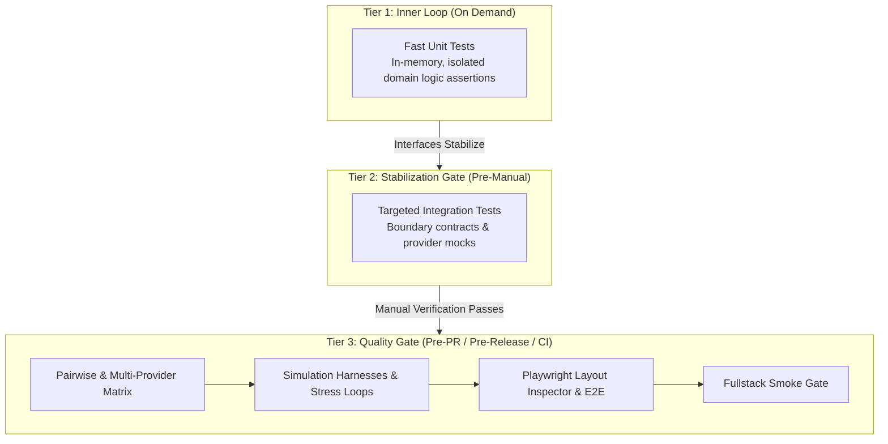

# 🏛️ Architecture: AgenticEngineeringToolbelt

This document explains the organization, design principles, and consumption models of **AgenticEngineeringToolbelt**.

---

## 🏗️ System Overview & Consumption Topology

---

## 🧩 Subsystem Breakdown

### 1. `archetypes/`
Curated polyglot engineering profiles codifying complete tech stacks, dependencies, and patterns:
- `fullstack-dotnet-react.md`: C# .NET 10 Minimal APIs/Controllers, Dapper + Stored Procs, SQLite WAL / MSSQL, React 19 + TypeScript + Zustand UI.
- `console-cli-dotnet.md`: C# .NET 10 Console & CLI utilities via `System.CommandLine` and Microsoft DI.
- `python-fastapi-mcp.md`: Python 3.12+ services, FastMCP tool servers, Pydantic v2 validation, and async I/O.
- `react-ts-vite-ui.md`: Standalone React 19 + TypeScript + Vite frontends, CSS Modules, and Playwright layout audits.
- `native-cpp-algorithms.md`: High-performance C++20/23 libraries, CMake/MSBuild, `vcpkg`, and C#/Python interop.

### 2. `standards/`
Canonical reference specifications for software design, testing, and delivery:
- `ENGINEERING_STYLE_GUIDE.md`: Master architectural guide covering traditional Git Flow, APIs First, ASD-STE100, VitePress, and polyglot conventions.
- `TESTING_HARNESS_PATTERNS.md`: Simulation and control harnesses treating software as observable dynamic systems, tiered testing cadence (Tier 1-3), and 6-part feedback envelopes.
- `CI_CD_PIPELINES.md`: 4-stage GitHub Actions quality gate specification (Integrity, Build & Test, Smoke, Analysis & Release).

### 3. `.agents/skills/`
Executable skill manifests compatible with agent skill registries (Antigravity, Claude Code, Cursor):
- `engineering-archetype/`: Instructs agents on architectural standards, prototyping, clarifying questions, and verification.
- `scaffold-project/`: Automates end-to-end scaffolding of projects with Git Flow, VitePress living docs, 4-stage CI/CD, and test harness baselines.
- `test-harness-builder/`: Generates high-volume stress loops, mock STDIO transports, diagnostic tap points, disturbance injection, Playwright UI drivers, and 6-part feedback envelopes.

### 4. `rules/`
Drop-in prompt rule files enforcing engineering discipline:
- `AGENTS.md`: Universal markdown rules for any repository root. Enforces Git Flow, APIs First, ASD-STE100, and harness patterns.
- `GEMINI.md`: Antigravity / Gemini specific context rules.
- `CLAUDE.md`: Claude Code context rules.

### 5. `templates/`
Generic configuration boilerplates, living documentation assets, workflows, and automation scripts:
- `configs/`: `Directory.Build.props`, `vite.config.ts`, `tsconfig.json`, `eslint.config.js`, `playwright.config.ts`, `vcpkg.json`, `pyproject.toml`.
- `docs/`: Starter `ARCHITECTURE.md` (with Mermaid templates), `REQUIREMENTS.md`, `CHANGELOG.md`, and VitePress configuration.
- `workflows/`: 4-stage `ci.yml`, `codeql.yml`, and `release.yml`.
- `scripts/`: `commit.sh` (atomic build & version bump) and `verify_release.py` (markdown link & version auditor).

---

## 🔄 Traditional Git Flow & Release Model

- **`main`**: Production tagged releases only (`vX.Y.Z`). Never commit directly.
- **`develop`**: Integration branch for completed feature branches.
- **`feature/*`**: Feature development branches branched off `develop`.
- **`release/*`**: Stabilization and version bumping branches off `develop`, merging to `main` and `develop`.
- **`hotfix/*`**: Urgent production bugfixes branching off `main`, merging to both `main` and `develop`.

---

## 🧪 Simulation & Controls Testing Cadence

---

## 📐 Non-Functional Guarantees

1. **Zero External Runtime Dependencies**: The toolbelt consists of portable Markdown, YAML, Shell, Python, and JSON configuration files.
2. **Submodule Safety**: Does not contain hardcoded absolute filesystem paths; all references are relative or template placeholders.
3. **Multi-Agent Interoperability**: Formatted to be recognized natively by Antigravity, Claude Code, Cursor, Codex, and custom MCP router gateways.
4. **Living Documentation Integrity**: ASD-STE100 rules ensure technical clarity, and Mermaid diagrams provide visual architecture in sync with source code.

