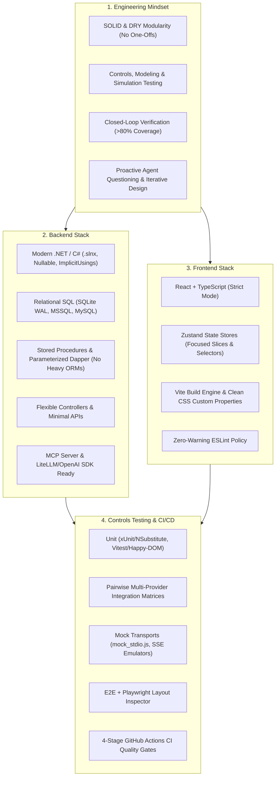

# 🛠️ AgenticEngineeringToolbelt

[](LICENSE)
[](https://github.com/spelech/AgenticEngineeringToolbelt)

> **Standardized architecture guidelines, controls-grade test harnesses, living documentation blueprints, and AI agent skills for high-velocity software engineering.**

`AgenticEngineeringToolbelt` codifies Steven T. Pelech's software engineering archetype, design-first workflows, and quality guardrails. It can be directly referenced by AI coding agents (Antigravity, Claude Code, Cursor, OpenClaw, Codex, etc.), linked into an IDE/CLI agent path, or embedded as a git submodule in any target repository.

---

## 🌟 Core Axioms & Tech Stack



---

## 📂 Repository Structure

```text
AgenticEngineeringToolbelt/
├── .agents/
│   └── skills/
│       └── engineering-archetype/     # Standalone agent skill definition
│           └── SKILL.md
├── rules/                             # System instructions & agent rules
│   ├── AGENTS.md                      # Universal rule file for repositories
│   ├── GEMINI.md                      # Rule file for Antigravity / Gemini agents
│   └── CLAUDE.md                      # Rule file for Claude Code agents
├── standards/                         # In-depth architectural standards
│   ├── ENGINEERING_STYLE_GUIDE.md     # Master Style Guide & Architecture Archetype
│   ├── TESTING_HARNESS_PATTERNS.md    # Controls & closed-loop testing guide
│   └── CI_CD_PIPELINES.md             # 4-stage GitHub Actions CI/CD blueprint
├── templates/                         # Generic setup configurations & boilerplates
│   ├── configs/                       # Directory.Build.props, vite, tsconfig, eslint, playwright
│   ├── docs/                          # ARCHITECTURE.md, REQUIREMENTS.md, CHANGELOG.md
│   ├── workflows/                     # ci.yml (4-stage gate), codeql.yml, release.yml
│   └── scripts/                       # commit.sh (atomic build & bump), verify_release.py
└── scripts/
    └── install.sh                     # Symlink / setup helper for agent environments
```

---

## 🚀 How to Use & Integrate

### 1. As a Git Submodule in a Target Repository
To embed these standards and templates directly into any project:
```bash
git submodule add https://github.com/spelech/AgenticEngineeringToolbelt.git .toolbelt
git submodule update --init --recursive
```
Then create a symlink or include the rule:
```bash
ln -sf .toolbelt/rules/AGENTS.md AGENTS.md
```

### 2. Adding to AI Agent Environments (Antigravity, Claude Code, Cursor)
Run the built-in install script to symlink the skill and rules into your local agent directories:
```bash
./scripts/install.sh
```

Or manually copy or symlink the skill to your agent skills folder:
```bash
# Antigravity / Gemini CLI:
mkdir -p ~/.gemini/antigravity-cli/skills/
ln -sf $(pwd)/.agents/skills/engineering-archetype ~/.gemini/antigravity-cli/skills/engineering-archetype

# Claude Code:
mkdir -p ~/.claude/skills/
ln -sf $(pwd)/.agents/skills/engineering-archetype ~/.claude/skills/engineering-archetype
```

### 3. Prompt / Instruction Reference
Include this snippet in your system prompt or custom instructions:
> *"Always adhere to Steven T. Pelech's engineering archetype codified in [AgenticEngineeringToolbelt](https://github.com/spelech/AgenticEngineeringToolbelt): ask proactive clarifying questions during design, use modern .NET/C# with Dapper and Stored Procedures over heavy ORMs, React + TypeScript + Zustand + Vite, controls-grade test harnesses (>80% coverage with closed-loop feedback), and 4-stage GitHub Actions CI gates on fresh feature branches."*

---

## 🤝 Collaboration & Working Model

- **Steven's Role**: System architecture, structural design, feature conceptualization, domain modeling, requirement specifications, stored procedure/data design, and Mermaid diagram designs.
- **Agent's Role**:
  - **Proactive Questioning**: Ask insightful clarifying questions to flesh out requirements and edge cases since ideas evolve during design.
  - **Iterative Prototyping**: Build prototypes, run test harnesses with closed-loop feedback, and iterate based on empirical findings.
  - **Branch & PR Discipline**: Work on fresh feature branches off `develop`/`main`, make fine-grained atomic commits, and open PRs that pass all CI quality gates.

---

## 📄 License

MIT © [Steven T. Pelech](LICENSE)
