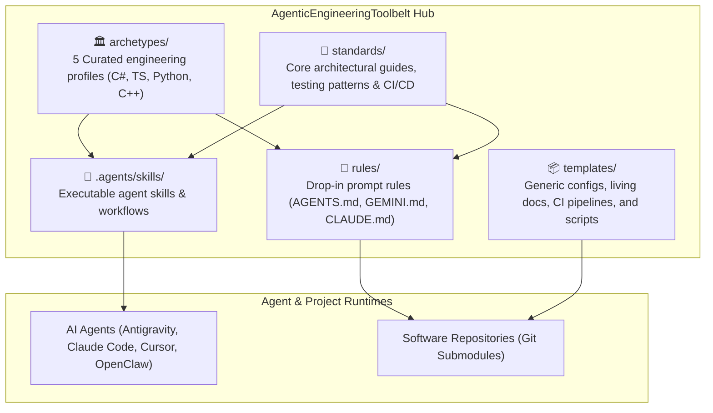

# 🛠️ AgenticEngineeringToolbelt

[](LICENSE)
[](https://github.com/spelech/AgenticEngineeringToolbelt)

> **Extensible engineering archetypes, architecture standards, controls-grade test harnesses, and AI agent tooling for high-velocity software engineering.**

`AgenticEngineeringToolbelt` is a modular toolkit designed to establish proven engineering standards, living documentation blueprints, and quality guardrails across projects and AI agent runtimes (Antigravity, Claude Code, Cursor, OpenClaw, Codex, etc.). It can be added as a **Git submodule** in repositories or installed directly into AI agent skill paths.

---

## 🏛️ Toolbelt Architecture



---

## 📚 Modules & Documentation

| Module | Description | Key Documents |
| :--- | :--- | :--- |
| [**`archetypes/`**](archetypes/README.md) | Curated polyglot engineering profiles. | • [**Controls Fullstack (.NET + React + SQL)**](archetypes/controls-fullstack-dotnet-react.md)<br>• [**C# Console & CLI**](archetypes/console-cli-dotnet.md)<br>• [**Python FastAPI & FastMCP**](archetypes/python-fastapi-mcp.md)<br>• [**React + TS + Vite UI**](archetypes/react-ts-vite-ui.md)<br>• [**Modern C++ Native Systems**](archetypes/native-cpp-algorithms.md) |
| [**`standards/`**](standards/) | Foundational engineering guidelines and testing patterns. | • [**Master Style Guide**](standards/ENGINEERING_STYLE_GUIDE.md)<br>• [**Testing Harness Patterns**](standards/TESTING_HARNESS_PATTERNS.md)<br>• [**CI/CD Pipeline Blueprint**](standards/CI_CD_PIPELINES.md) |
| [**`rules/`**](rules/) | Universal rule files for AI coding assistants. | • [**AGENTS.md**](rules/AGENTS.md) (Universal)<br>• [**GEMINI.md**](rules/GEMINI.md) (Antigravity)<br>• [**CLAUDE.md**](rules/CLAUDE.md) (Claude Code) |
| [**`.agents/skills/`**](.agents/skills/) | Executable agent skill definitions. | • [**`engineering-archetype`**](.agents/skills/engineering-archetype/SKILL.md)<br>• [**`scaffold-project`**](.agents/skills/scaffold-project/SKILL.md)<br>• [**`test-harness-builder`**](.agents/skills/test-harness-builder/SKILL.md) |
| [**`templates/`**](templates/) | Generic configuration boilerplates, workflows, and scripts. | • `configs/` (`Directory.Build.props`, `vite`, `tsconfig`, `eslint`, `playwright`, `vcpkg`, `pyproject`)<br>• `docs/` (`ARCHITECTURE.md`, `REQUIREMENTS.md`)<br>• `workflows/` (4-stage `ci.yml`, `codeql.yml`)<br>• `scripts/` (`commit.sh`, `verify_release.py`) |

---

## 🚀 Quick Start & Integration

### 1. Embed as a Git Submodule
Add the toolbelt to any repository to provide instant access to templates, rules, and standards:
```bash
git submodule add https://github.com/spelech/AgenticEngineeringToolbelt.git .toolbelt
git submodule update --init --recursive
ln -sf .toolbelt/rules/AGENTS.md AGENTS.md
```

### 2. Install to Local Agent Skill Registries
Run the installer script to symlink skills into your agent environments (Antigravity, Claude Code, Workspace):
```bash
./scripts/install.sh
```

### 3. Agent System Prompt Reference
To align an AI agent session with an archetype:
> *"Always adhere to the engineering standards and archetypes codified in [AgenticEngineeringToolbelt](https://github.com/spelech/AgenticEngineeringToolbelt) (see [Master Engineering Style Guide](https://github.com/spelech/AgenticEngineeringToolbelt/blob/main/standards/ENGINEERING_STYLE_GUIDE.md))."*

---

## 📄 License

MIT © [Steven T. Pelech](LICENSE)
