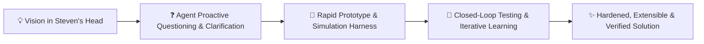

# 🏛️ Archetype: Fullstack (.NET + React + SQL) with Simulation & Control Harness

> **Architect**: Steven T. Pelech  
> **Focus**: Controls engineering, simulation, deterministic high-concurrency systems, and closed-loop testing for developers and AI.

---

## 🤝 1. Collaboration & Iterative Design Model

- **Vision & Exploration**: Steven drives the conceptual vision, architecture, and feature ideas. Because ideas start in his head and evolve, **part of the agent's primary job is to ask insightful clarifying questions** to flesh out requirements, edge cases, and design constraints before or during development.
- **Iterative Prototyping**: We build via rapid prototyping and closed-loop evaluation—prototyping early, running simulation harnesses, learning from live behavior, and refining architecture iteratively.
- **Traditional Git Flow Workflow**:
  - The repository adheres strictly to traditional Git Flow:
    - `main`: Production releases with immutable SemVer tags (`vX.Y.Z`).
    - `develop`: Primary integration branch for verified feature work.
    - `release/*`: Release stabilization branches branched from `develop`, merged into both `main` and `develop`.
    - `feature/*`: Feature branches branched from `develop`, merged back into `develop` via PR.
    - `hotfix/*`: Emergency production fixes branched from `main`, merged into both `main` and `develop`.
  - All new features and significant plans start on a **fresh `feature/*` branch** off `develop`.
  - Work is committed with **fine-grained, atomic commits** to keep history transparent and legible.
  - Features culminate in a **Pull Request (PR)** where all multi-stage CI quality gates must pass before merging.

---

## 🎯 2. The 12 Core Tenets

1. **Division of Labor & Proactive Questioning**: Agent asks clarifying questions to flesh out requirements; iterative prototyping with fast feedback loops.
2. **Controls, Modeling & Simulation Mindset**: Systems gravitate towards rich simulation and control test harnesses, observable dynamic systems, diagnostic tap points (in-memory ring buffers, diagnostic hooks), simulated environments (mock transports like `mock_stdio.js`, SSE emulators), loopback tests, and dedicated debug tooling for developers and AI.
3. **Requirements & Architecture Decision Records (ADRs)**: Requirements use clear narrative acceptance criteria by default. Formal `REQ-xxx` prefixes are reserved for projects where formal ADR (Architecture Decision Record) catalogs are explicitly used.
4. **Guardrails & Closed-Loop Testing**: Establish tight guardrails via requirements, design plans, and simulation harnesses with **closed-loop feedback** (executing against running processes, ingesting structured 6-part feedback envelopes, and using output metrics to iteratively improve performance, accuracy, and UI stability).
5. **Traditional Git Flow Discipline**: Strict branching model (`main`, `develop`, `release/*`, `feature/*`, `hotfix/*`). All development occurs on isolated `feature/*` branches off `develop`, merged via PR passing all CI gates.
6. **Atomic Commits**: Create fine-grained, **atomic commits** on the branch with clear messages so history is traceable and progress can be reviewed step-by-step.
7. **High Code Coverage**: Target **>80% code coverage** with meaningful unit, integration, and E2E test suites.
8. **SOLID & DRY Modularity**: Heavy emphasis on SOLID principles, small and focused files ($\le$ 500 LOC), and breaking apart multi-concern components. Avoid copy-paste and one-offs—design modules to be reusable, pluggable, and extensible.
9. **APIs First, MCP Later**: Domain logic, models, schemas, and persistence live in typed, self-contained APIs (Minimal APIs or Controllers) first. Expose Model Context Protocol (MCP) server tools as lightweight wrapper adapters second for AI agent integration.
10. **Security & Encryption by Default**: Encrypt sensitive data at rest and in transit (AES-256-GCM, DPAPI, SQLCipher, Vault) and apply authentication/authorization unless explicitly deemed unnecessary.
11. **LLM Integration Standard**: When implementing LLM features, standardize on **LiteLLM / OpenAI SDK** compatibility (for unified completions, streaming, embeddings, tool calling, and model routing).
12. **Automated Documentation & Releases**: Automate documentation generation (catalogs, schemas, API docs), automated version bumping (`bump_version.py`, `commit.sh`), and release pipelines (`verify_release.py`, GitHub Actions) wherever possible. Living documentation with Mermaid sequence and flow diagrams, conforming to ASD-STE100.

---

## 💻 3. Backend Architecture (Modern .NET / C#)

- **Language & Runtime**: Modern .NET (C#) with `<Nullable>enable</Nullable>`, `<ImplicitUsings>enable</ImplicitUsings>`, and `.slnx` solution format.
- **Persistence Philosophy**: Relational SQL (SQLite WAL, MS SQL, MySQL) over NoSQL or heavy ORMs (like Entity Framework Core).
  - Use **Dapper** / ADO.NET with **Stored Procedures** where appropriate (e.g. security evaluation, audit logging, batch operations) and parameterized queries with `IDbConnectionFactory`.
  - Enable SQLite WAL mode where applicable (`PRAGMA journal_mode = WAL;`).
  - **No Heavy ORMs**: Do not introduce Entity Framework Core or NoSQL document databases unless explicitly requested.
- **API Architecture (APIs First)**: Choose pragmatically between **Controllers** (`[ApiController]`) for rich domain slices and **Minimal APIs** (`Map*Endpoints()`) for lightweight routing and streaming. Ensure domain logic is fully testable and accessible before adding MCP tools.
- **Resilience**: Thread-safe state machines (`ConcurrentDictionary`, `PendingRequestTcs`), full `CancellationToken` propagation.

---

## 🎨 4. Frontend Architecture (React / TypeScript / Zustand / Vite)

- **Stack**: React, TypeScript in strict mode (`strict: true`), Vite.
- **State Management**: **Zustand** stores (`use*Store.ts`) with focused state slices and selector hooks.
- **Linter Policy**: Zero linter warnings permitted (`eslint . --max-warnings 0`).
- **Styling**: CSS custom properties and theme tokens with dark mode support. Avoid heavy UI library bloat.

---

## 🧪 5. Testing & UI Layout UX (Tiered Testing Cadence)

Testing adheres to the **Tiered Testing Cadence ("Test When It Makes Sense")**:

1. **Tier 1 (Inner Loop / Rapid Development)**:
   - High-speed unit tests (xUnit + NSubstitute in C#; Vitest + `@testing-library/react` + `happy-dom` in TS).
   - Executed on-demand during active coding for immediate feedback.
2. **Tier 2 (Stabilization Gate / Pre-Manual Verification)**:
   - Simulation & control harnesses, diagnostic tap points, and Playwright layout audits.
   - Executed before any manual user verification or before opening PRs to catch regressions early.
3. **Tier 3 (Pre-PR / Pre-Release / CI Quality Gate)**:
   - Pairwise multi-provider database matrices, live background process smoke tests, and full 4-stage CI gate.
   - Executed prior to PR merge and during release stabilization.

### Simulation & Controls Harness Tooling
- **Observable Tap Points**: Event hooks and ring buffers exposing internal states for developer and AI inspection.
- **Mock Transports & Disturbance**: Synthetic STDIO/SSE harnesses (`mock_stdio.js`) with disconnect triggers, latency spikes, and malformed payload injection.
- **Structured Feedback**: Standardized 6-part agent feedback envelope (`inputs`, `active_settings`, `action_history`, `output_delta`, `captured_logs`, `reproduction_command`).
- **E2E & Layout UX**: Playwright paired with `playwright-layout-inspector` to audit:
  - Zero horizontal overflow (`expect(page).toHaveNoLayoutOverflow()`)
  - Mobile viewport fit & zoom accessibility (`expect(page).toHaveMobileFit()`)
  - Touch ergonomics (`expect(page).toHaveTouchFriendlyTargets({ minSize: 24 })`)
  - Composite UX score (`expect(page).toPassLayoutAudit({ minScore: 85 })`)
