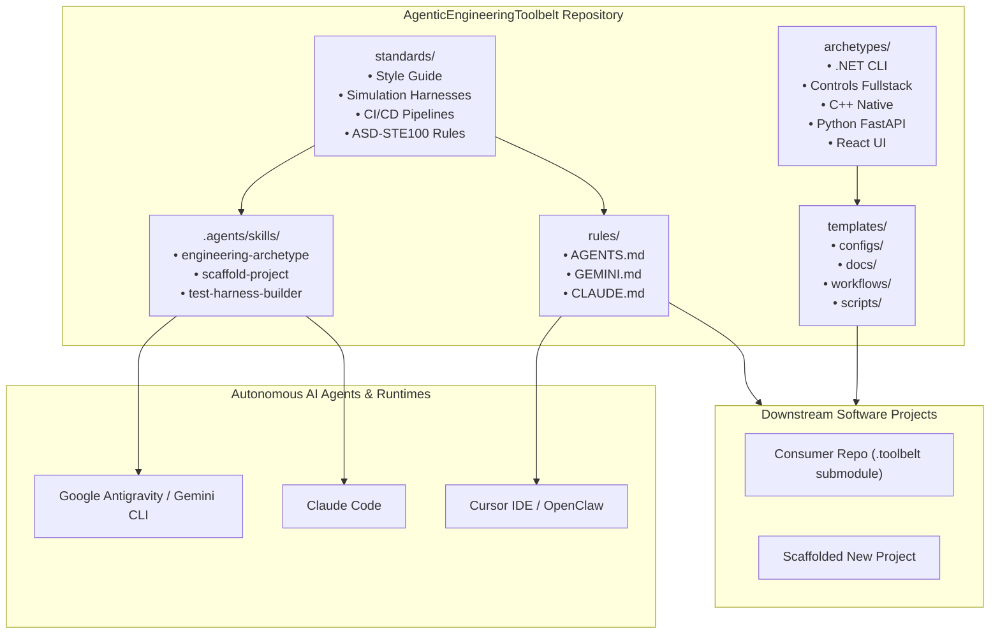

## 🏛️ System Architecture Topology

The following diagram illustrates how autonomous agents and consumer software repositories consume the **AgenticEngineeringToolbelt**:



---

## 🚀 Quickstart Guide

Install the toolbelt as a submodule in any software repository:

```bash
# Add the toolbelt as a git submodule
git submodule add https://github.com/spelech/AgenticEngineeringToolbelt.git .toolbelt
git submodule update --init --recursive

# Run the installation script to link agent skills
bash .toolbelt/scripts/install.sh
```

### Local Documentation Development

Launch the VitePress live documentation development server:

```bash
# Install dependencies
npm install

# Start local dev server
npm run docs:dev

# Build static assets
npm run docs:build
```

---

## 📐 Core Engineering Standards

1. [Engineering Style Guide](/standards/engineering-style-guide): Architecture principles, language matrix, and solid conventions.
2. [Simulation & Control Harnesses](/standards/testing-harness-patterns): Observation, diagnostic tap points, and 6-part feedback envelopes.
3. [CI/CD Pipelines](/standards/ci-cd-pipelines): 4-stage GitHub Actions automation and quality gates.
4. [ASD-STE100 Writing Rules](/standards/asd-ste100): Simplified Technical English standards for documentation.
