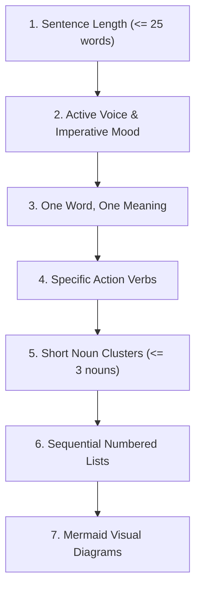

# 📖 ASD-STE100 Simplified Technical English Guide

This document defines technical writing standards for the **AgenticEngineeringToolbelt**. All documentation, architecture guides, and code comments must follow these rules.

---

## 🎯 Purpose and Objectives

ASD-STE100 reduces language complexity. It improves readability for human engineers and artificial intelligence agents.

Key objectives:
- Eliminate linguistic ambiguity in specifications.
- Ensure consistent technical terminology across polyglot repositories.
- Facilitate high-speed semantic parsing by large language models.
- Prevent misinterpretation during automated code generation.

---

## 📐 Core Writing Rules

### Rule 1: Keep Sentences Short
- Keep sentences to a maximum of **20 to 25 words**.
- Express only **one complete thought** per sentence.
- Split compound sentences that use multiple conjunctions.

### Rule 2: Use Active Voice and Imperative Mood
- State who or what performs the action.
- Use imperative mood for procedural instructions and guidelines.
- Do not use passive voice constructions.

| Passive Form (Do Not Use) | Active / Imperative Form (Approved) |
| :--- | :--- |
| The unit test suite is executed by the CI runner. | The CI runner executes the unit test suite. |
| Configuration parameters should be validated. | Validate all configuration parameters before execution. |
| The ring buffer is read by the simulation harness. | The simulation harness reads the ring buffer. |

### Rule 3: One Word for One Meaning
- Select one approved technical term and use it consistently.
- Do not alternate between synonyms to vary writing style.
- Keep naming identical across code, configurations, and documentation.

| Inconsistent Synonyms (Do Not Use) | Standard Term (Approved) |
| :--- | :--- |
| harness / test loop / runner / driver | **Simulation Harness** |
| endpoint / action / route / path | **API Route** |
| tap point / hook / probe / monitor | **Diagnostic Tap Point** |

### Rule 4: Eliminate Vague Verbs
- Do not use generic verbs like *make*, *do*, *get*, or *perform*.
- Use precise verbs that describe the exact system operation.

| Vague Verb | Precise Replacement |
| :--- | :--- |
| Make a new connection to SQL | Connect to the SQL server |
| Do a check on input parameters | Validate all input parameters |
| Get data from cache | Retrieve records from Redis cache |
| Deal with error conditions | Handle timeout exceptions |

### Rule 5: Limit Noun Clusters
- Do not string more than **three consecutive nouns** together.
- Use prepositions to clarify relationships between components.

| Complex Noun Cluster | Clarified Phrase |
| :--- | :--- |
| order processing queue worker thread | worker thread for the order processing queue |
| client state event listener registry | registry of event listeners for client state |

### Rule 6: Use Structured Lists for Steps
- Use **numbered lists** for sequential procedures.
- Use **bulleted lists** for unordered catalog items or requirements.
- Begin each list item with a capital letter and an imperative verb.

### Rule 7: Complement Text with Diagrams
- Always accompany complex architectural descriptions with **Mermaid diagrams**.
- Use `flowchart TD` or `flowchart LR` for system topology.
- Use `sequenceDiagram` for distributed request lifecycles.
- Use `stateDiagram-v2` for finite state machines and lifecycle transitions.

---

## 📋 Verification Checklist

Before publishing documentation, verify:
- [ ] Every sentence contains 25 words or fewer.
- [ ] All procedures use active, imperative verbs.
- [ ] Technical terms match canonical codebase names exactly.
- [ ] Architectural sections include valid Mermaid diagrams.
- [ ] Relative markdown links resolve cleanly.
