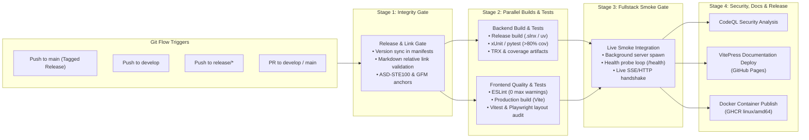

# 🚀 Multi-Stage GitHub Actions CI/CD Pipeline Blueprint

This document details the standardized 4-stage GitHub Actions CI/CD architecture deployed across projects. It codifies Git Flow triggers, quality gates, and automated living documentation deployment.

---

## 🏛️ Pipeline Topology

---

## 🚦 1. Git Flow Trigger Matrix

The pipeline adapts execution stages based on the Git Flow branch and lifecycle event:

| Branch / Context | Trigger Event | Executed Stages | Output Deliverables |
| :--- | :--- | :--- | :--- |
| `feature/*` | Pull Request to `develop` | Stage 1 (Integrity), Stage 2 (Build & Test), Stage 3 (Smoke) | PR test reports, coverage deltas |
| `develop` | Push / Merged PR | Stage 1 (Integrity), Stage 2 (Build & Test), Stage 3 (Smoke), Stage 4 (CodeQL) | Integration build verification |
| `release/*` | Push / Release branch creation | Stage 1 (Integrity & Version Audit), Stage 2 (Build & Test), Stage 3 (Smoke) | Release staging validation, draft release |
| `hotfix/*` | Pull Request to `main` and `develop` | Stage 1 (Integrity), Stage 2 (Build & Test), Stage 3 (Smoke) | Critical hotfix verification |
| `main` | Push with SemVer Tag (`vX.Y.Z`) | All Stages (1, 2, 3, 4: CodeQL, Docs, Docker) | Production GHCR containers, GitHub Release, GitHub Pages docs |

---

## 📋 2. Stage Descriptions

### Stage 1: Release & Link Integrity Gate
Runs `scripts/verify_release.py` to ensure that:
- Version numbers match across all manifest files (`.csproj`, `package.json`, `pyproject.toml`, `CHANGELOG.md`).
- All relative markdown links and anchor targets resolve to existing files and valid headings.
- Documentation adheres to standard directory structure and file conventions.

### Stage 2: Parallel Builds & Tests
- **Backend**:
  - Restores dependencies and builds in Release configuration.
  - Executes unit and integration test suites with code coverage collection ($\ge$ 80% coverage required).
  - Uploads TRX test result files and code coverage summaries.
- **Frontend**:
  - Installs dependencies using clean install (`npm ci`).
  - Runs ESLint with zero-warning tolerance (`--max-warnings 0`).
  - Compiles production assets via `vite build`.
  - Runs Vitest unit suites and Playwright layout inspector audits.

### Stage 3: Fullstack Integration Smoke Gate
- Spawns compiled backend and frontend services in the background.
- Polls the `/health` endpoint until a healthy response returns within timeout limits.
- Executes real HTTP and SSE communication handshakes.
- Terminates background processes cleanly and verifies zero orphan processes.

### Stage 4: Security, Documentation & Release
- **CodeQL Security Analysis**: Runs multi-language static code analysis across C#, Python, and TypeScript to detect vulnerabilities.
- **VitePress Living Documentation Deployment**:
  - Builds the static documentation site using `npx vitepress build docs`.
  - Renders native Mermaid diagrams into accessible SVG assets.
  - Publishes static assets directly to GitHub Pages on verified release tags and `main` updates.
- **Docker Container Publish**:
  - Builds native `linux/amd64` container images without emulation overhead.
  - Authenticates and pushes multi-stage container images to GitHub Container Registry (GHCR).
  - Attaches release tags matching repository SemVer (`ghcr.io/org/repo:vX.Y.Z` and `:latest`).
