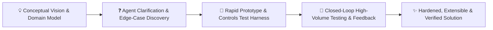
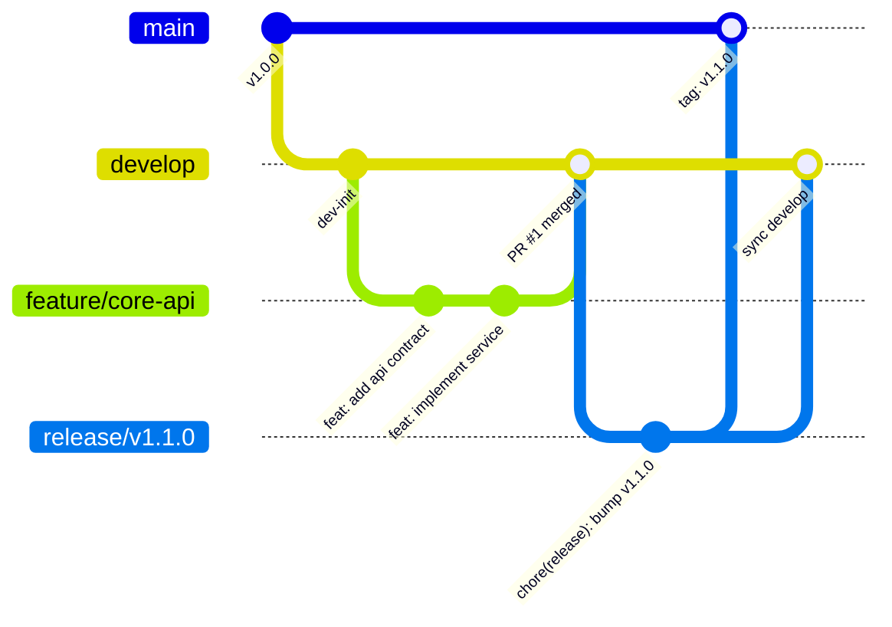
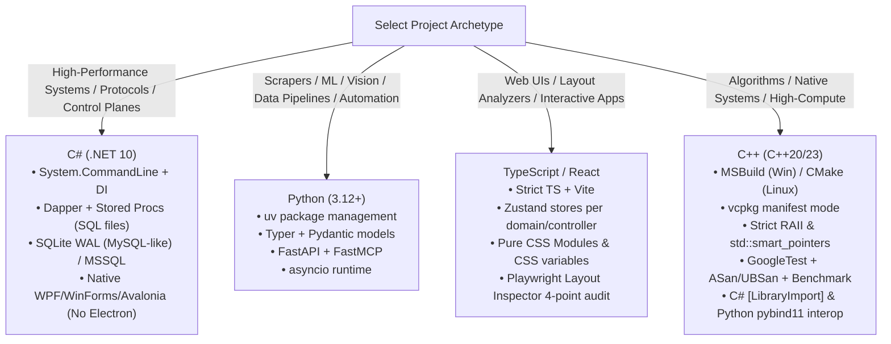
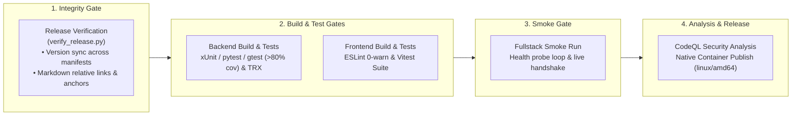

# 🏛️ Master Engineering Style Guide & Architecture Archetype

This document codifies the core engineering principles, architectural patterns, polyglot language standards, test harness conventions, and living documentation practices established across Steven T. Pelech's repositories and agent workflows.

---

## 🤝 1. Collaboration & Iterative Design Model

- **Vision & Exploration**: Steven drives the conceptual vision, architecture, and feature ideas. Because ideas start conceptually and evolve during design, **part of the agent's primary job is to ask insightful clarifying questions** to flesh out requirements, edge cases, and design constraints before or during development.
- **Iterative Prototyping**: Build via rapid prototyping and closed-loop evaluation—prototyping early, running test harnesses, learning from live behavior, and refining architecture iteratively.
- **Git Flow Branching & Release Discipline**:
  - Adopt traditional Git Flow across all repositories:
    - `main`: Production tagged releases only (`vX.Y.Z`). Every commit represents a verified release. Direct pushes are protected and forbidden.
    - `develop`: Primary integration branch for ongoing work. Feature branches merge here through Pull Requests.
    - `feature/*`: Dedicated branches created off `develop` (`feature/feature-name`). Contains isolated unit and functional work. Merges back to `develop` after Tier 2 and Tier 3 gates pass.
    - `release/*`: Created off `develop` (`release/vX.Y.Z`) when features freeze for an upcoming release. Dedicated to version bumping, changelog finalization, and release verification. Merges into `main` (with release tag) and syncs back to `develop`.
    - `hotfix/*`: Created directly off `main` (`hotfix/vX.Y.Z`) to address critical production defects. Merges into both `main` (with release tag) and `develop`.
  - Work is committed with **fine-grained, atomic Conventional Commits** (`feat:`, `fix:`, `test:`, `docs:`, `chore:`).
  - Merges culminate in Pull Requests where all CI quality gates must pass before merging.

---

## 🎯 2. Foundational Engineering Principles

### 2.1 SOLID & Modularity
1. **Single Responsibility**: Each class, module, and component must have a single, well-defined reason to change. Decompose large files and multi-concern classes.
2. **File Size & Cohesion Limit**: Classes or files exceeding **500 lines of code** must be broken down into focused partial classes, sub-services, or distinct domain helpers.
3. **Open / Closed**: Design for pluggability and extensibility without modifying core engine logic.
4. **Interface Segregation**: Enforce narrow, client-focused interfaces (`IStateReader`, `IStateWriter`, `IHealthCheckable`) over fat monolithic interfaces.
5. **Dependency Inversion**: High-level modules must depend on abstractions. **Build interfaces (`I*`) even for single implementations** to ensure 100% testability, mockability, and loose coupling.

### 2.2 DRY vs. YAGNI & KISS
1. **Rule of Three for DRY**: Duplication is acceptable across 2 instances if contexts or data shapes differ slightly. Refactor into a shared utility or generic abstraction on the **3rd occurrence**.
2. **YAGNI (You Aren't Gonna Need It)**: Do not build speculative multi-tier frameworks, premature plugin registries, or unused generic abstractions. Build cleanly and simply for the concrete requirement.
3. **KISS (Keep It Simple, Stupid)**: Choose direct, readable implementations over clever indirection.

### 2.3 Semantic Naming & Anti-Pattern Bans
1. **Banned "Junk-Drawer" Anti-Patterns**: Explicitly forbid catch-all class names such as `GeneralManager`, `AppHelper`, `DataUtil`, or `CommonHandler` that accumulate unrelated functions.
2. **Role- & Verb-Based Naming**:
   - **Services / Handlers**: Name strictly by role or action: `DatabaseSeederService`, `UserAuthenticator`, `OrderProcessor`, `StateTransitionLogger`.
   - **Interfaces**: C# interfaces MUST use the `I` prefix (`IDbConnectionFactory`, `ITransportChannel`). TypeScript/Python interfaces use descriptive role names or `*able` traits.
   - **UI Components**: Name strictly after the visual entity or view role (`ServerStatusCard`, `DeviceListTable`, `HeaderNavbar`). Never name components after temporary feature names, tasks, or git branches.
   - **Zustand Stores**: Prefix with `use*Store.ts` (`useAuthStore.ts`, `useServerStore.ts`).

### 2.4 Performance & Efficiency Discipline
1. **Database Trips**: If an operation requires 3+ database round-trips or multi-table joins, consolidate into a single **Stored Procedure** or multi-result batch query.
2. **Frontend Re-renders**: Mandate **granular Zustand selectors** (`useServerStore(s => s.serverCount)`) to eliminate unnecessary component re-renders. Separate high-frequency reactive widgets from static layout trees.
3. **API Independence**: Provide focused, individual REST/HTTP endpoints so UI components and stores can independently fetch and manage their own data lifecycles.

### 2.5 Error Handling & Diagnostics
1. **Never Leak Raw Stacks**: Prevent raw stack traces or internal database schemas from leaking to clients. Return clean error payloads with correlation IDs.
2. **Domain Exceptions**: Use well-defined domain exceptions for unexpected system failures; use Result/boolean patterns for expected validation failures.
3. **Reproducible Debug Payloads**: All error logs must capture the error description, stack trace, and the exact input payload/state that caused the failure to aid deterministic reproduction.

### 2.6 APIs First, MCP Later Architectural Rule
1. **Foundational Domain APIs**: Always implement domain business logic, data models, validation, error handling, and security inside typed, first-class APIs (e.g., ASP.NET Core Minimal APIs / Controllers, FastAPI endpoints, C++ native libraries, or CLI interfaces).
2. **Secondary MCP Adapter**: Expose Model Context Protocol (MCP) tools strictly as thin, lightweight adapter layers that call into existing, hardened APIs or service interfaces.
3. **Architectural Isolation**:
   - Developers, integration suites, and test harnesses can exercise and verify APIs directly via standard HTTP, CLI, or in-memory calls without requiring an active LLM or MCP host runtime.
   - Core domain logic is written, tested, and maintained in a single place rather than duplicated across agent wrappers.
   - Preserves software independence and robustness against evolving AI protocol interfaces or tool schemas.

---

## 💻 3. Polyglot Language & Archetype Standards

---

## 🏛️ 4. Backend Architecture & Persistence

### 4.1 C# .NET 10
- **Project Structure**: Modern `.slnx` solution format with `<Nullable>enable</Nullable>`, `<ImplicitUsings>enable</ImplicitUsings>`, and `Directory.Build.props`.
- **API Routing Division**:
  - **Minimal APIs**: Reserved for small projects, simple feed-through endpoints, lightweight vertical slices, and streaming routes.
  - **Controllers (`[ApiController]`)**: Standard for larger control planes, rich multi-route resources, admin portals, and distinct domain slices.
- **Persistence & Stored Procedures**:
  - Dedicated `.sql` stored procedure files preferred over inline code queries.
  - MCG-style idempotent schema migrations and seeders (`DatabaseSeederService.cs`).
  - Configure SQLite schemas and types to be as MySQL/relational-compatible as possible to ensure friction-free migrations to containerized SQL engines.
  - Mandatory SQLite WAL pragmas: `PRAGMA journal_mode = WAL; PRAGMA synchronous = NORMAL; PRAGMA busy_timeout = 5000; PRAGMA foreign_keys = ON;`.
- **Configuration & Auth**:
  - Prefer `appsettings.json` (with environment overrides) as the primary configuration vehicle.
  - Forward auth headers (`Remote-User`, `Remote-Groups`) for human web traffic; **Bearer tokens** for machine / agent service-to-service auth.
  - Encryption at rest via self-contained AES-256-GCM symmetric encryption (avoiding OS-locked DPAPI/Vault dependencies).
- **Concurrency & Resilience**:
  - `ConcurrentDictionary` for thread-safe lookups/caches.
  - `System.Threading.Channels.Channel<T>` for high-throughput, decoupled producer-consumer pipelines.
  - `SemaphoreSlim` for rate-limiting and atomic locks; `Interlocked` for parallel execution metrics.
  - **100% CancellationToken propagation** across all async database, I/O, and streaming calls.
- **Diagnostics**:
  - Standard `/health` probe on all web services.

---

## 🎨 5. Frontend Architecture (React / TypeScript / Zustand / Vite)

- **Framework & Stack**: React with TypeScript in strict mode (`"strict": true`), bundled via Vite.
- **Folder Structure**: Clean domain/view-oriented structure (`components/common/`, `components/[ComponentName]/`, `hooks/`, `stores/`, `views/`). Never organized by temporary feature/branch names.
- **State Management**: **Zustand** stores organized into separate files mapped directly per domain, data source, or backend API controller.
- **Selectors**: Mandatory granular selector hooks (`const count = useServerStore(s => s.servers.length)`).
- **Data Fetching**: Lean, native `fetch` API wrappers by default; avoid TanStack Query bloat unless caching/sync complexity strictly justifies the package weight.
- **Styling**: Pure CSS with standard CSS Modules and theme variables (`theme.css`). Bespoke, lightweight UI components over heavy external UI libraries.
- **Desktop Strategy**: Native **C# UI frameworks** (WPF / WinForms / Avalonia). Avoid Electron completely.
- **UI Quality Gates (`playwright-layout-inspector`)**:
  - Mandatory 4-point automated layout audit across mobile and desktop viewports:
    1. `expect(page).toHaveNoLayoutOverflow()` (Zero horizontal bleed)
    2. `expect(page).toHaveMobileFit()` (Responsive viewport scaling)
    3. `expect(page).toHaveTouchFriendlyTargets({ minSize: 24 })` (Touch target sizing)
    4. `expect(page).toPassLayoutAudit({ minScore: 85 })` (Composite UX health)
  - UI components must include `data-testid` attributes so AI agents can drive automated browser journeys.
  - Live validation against running backend instances is always preferred over pure mocking.

---

## 🧪 6. Simulation & Control Harnesses (For Developers & AI)

- **Controls Mindset**: Software operates as an observable dynamic system requiring continuous state inspection, actuation, and closed-loop feedback. Build dedicated test harnesses whenever crossing an API/network boundary, managing stateful protocols, or implementing algorithms with tunable variability.
- **Dynamic System Observation & Stress Capabilities**:
  - **Diagnostic Tap Points**: Agents inject internal diagnostic hooks (in-memory ring buffers, state transition listeners, and frontend `data-testid` attributes) during development to expose internal state without relying on string log scraping. Clean up or compile-guard debug hooks before production release.
  - **High-Volume Simulation Loops**: Harnesses execute high-volume throughput stress loops, synthetic batch feeds, parameter sweeps, and convergence tests to detect race conditions, memory leaks, and performance drift under load.
  - **Disturbance Ingestion**: Inject malformed payloads (corrupt JSON, truncated strings), synthetic network latency, and abrupt disconnects (socket drops, process terminations) to verify error fallbacks, retry logic, and clean `CancellationToken` teardowns.
  - **Standardized 6-Part Feedback Envelope**: When a test harness, integration test, or simulation loop fails, format the failure payload into a standardized diagnostic envelope:
    1. **Inputs**: Raw parameters and seeds fed to the harness.
    2. **Assumptions**: Environmental preconditions expected by the test.
    3. **Active Settings**: Configurations, connection pools, timeouts, and database pragmas.
    4. **Action History**: Exact sequence of state transitions leading up to the failure.
    5. **Output Delta**: Expected output vs actual outcome delta.
    6. **Captured Logs & Repro Command**: Ring-buffer error messages and deterministic CLI reproduction command.
- **Tiered Testing Cadence ("Test When It Makes Sense")**:
  - Avoid running heavy, slow, or brittle integration suites while feature interfaces and algorithms are actively mutating during rapid prototyping.
  - **Tier 1 (Inner Loop / Rapid Development)**:
    - Fast, isolated in-memory unit tests run on demand.
    - Zero mandatory test runs during early exploratory prototyping and drafting.
  - **Tier 2 (Stabilization Gate / Pre-Manual Verification)**:
    - Run unit test suites and targeted integration tests once feature interfaces and domain boundaries stabilize, immediately prior to developer or agent manual testing.
  - **Tier 3 (Pre-PR / Pre-Release / CI Quality Gate)**:
    - Execute full test matrix, multi-provider integration tests, high-volume simulation harnesses, and Playwright layout audits before merging into `develop`/`main` and within CI pipelines.
- **Coverage Target**: $\ge$ 80% code coverage across unit, integration, and E2E suites.

---

## 📑 7. Living Documentation & Automation

### 7.1 ASD-STE100 & Mermaid Documentation Standards
- **ASD-STE100 (Simplified Technical English)**:
  - Enforce for all user-facing documentation, README files, architectural blueprints, and living specs.
  - Keep sentences short and direct ($\le$ 20-25 words per sentence).
  - Use active voice and imperative mood for instructions.
  - Standardize vocabulary; avoid ambiguous jargon, colloquialisms, and redundant synonyms.
  - Maintain one core instruction or requirement per sentence.
- **Mermaid Visual Documentation**:
  - Enforce native Mermaid syntax for architectural and flow diagrams (`flowchart TD`, `flowchart LR`, `sequenceDiagram autonumber`, `stateDiagram-v2`, `gitGraph`).
  - Keep diagrams in version control alongside markdown content to prevent architectural drift.
- **VitePress Living Documentation Engine**:
  - Host project living documentation via VitePress deployed to GitHub Pages.
  - Provide structured navigation across Architecture, Standards, API references, and Agent workflows.

### 7.2 Repository Documentation Assets
- **`ARCHITECTURE.md`**:
  - Top-down Mermaid topology flowchart (`flowchart TD`).
  - Step-numbered sequence diagrams (`sequenceDiagram autonumber`).
  - Subsystem breakdowns and non-functional SLAs.
- **`README.md`**: Standardized badges (CI, Coverage, Language, Docker, License), Architecture diagram, Quick start (Docker & Local), REST/MCP Tool reference.
- **Automated Commit & Verification**:
  - `commit.sh`: Checks compilation, runs automated version bumping, and produces atomic commits.
  - `verify_release.py`: Verifies version sync across manifests (`.csproj`, `package.json`, `pyproject.toml`) and validates all relative markdown links and anchors.

---

## 🚀 8. 4-Stage GitHub Actions CI/CD Pipeline

