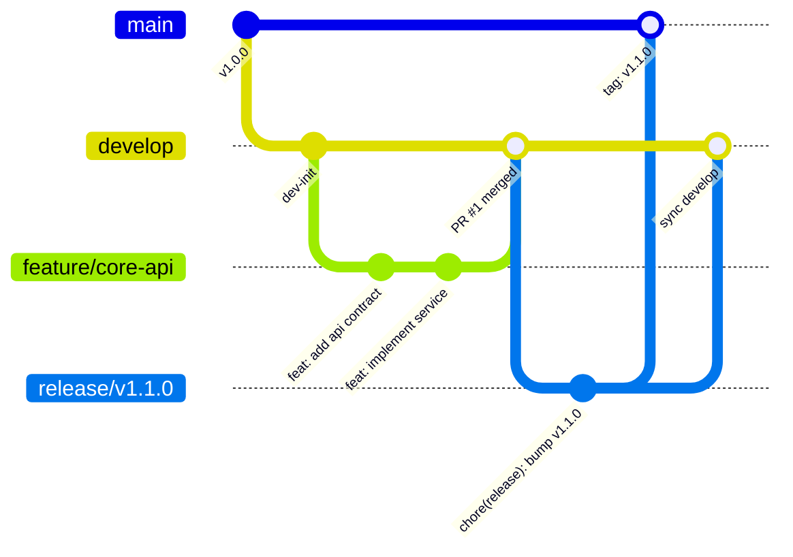

# 🏛️ Architecture & Specification: Agentic Engineering Toolbelt Refinements

**Date:** 2026-09-20  
**Author:** Steven T. Pelech & Antigravity  
**Status:** Approved  

---

## 1. Executive Summary

This specification codifies core enhancements to the **Agentic Engineering Toolbelt** repository (`AgenticEngineeringToolbelt`) and its downstream templates:
1. **Branching Model & Release Lifecycle**: Adoption of a traditional Git Flow model (`main`, `develop`, `release/*`, `feature/*`, `hotfix/*`) supported by GitHub Actions workflow-driven releases and minimal helper scripts.
2. **Architecture Tenet**: Reaffirming "APIs First, MCP Later"—harden first-class, typed domain APIs (REST/HTTP, gRPC, CLI) before exposing them via Model Context Protocol (MCP) tool wrappers.
3. **Simulation & Control Harnesses**: Reframing "controls-grade" terminology to highlight software as a dynamic, observable, and controllable system. Diagnostic tap points, high-volume simulation loops, and structured 6-part feedback envelopes serve both human developers and AI coding agents.
4. **Tiered Testing Cadence**: A pragmatic testing rhythm ("test when it makes sense") that avoids wasting cycles on heavy test suites during rapid feature prototyping, triggering tests at stable milestones and CI gates.
5. **Living Documentation Engine**: Integration of VitePress with native Mermaid diagramming deployed to GitHub Pages for this toolbelt, alongside reusable downstream documentation templates and enforcement of the **ASD-STE100** (Simplified Technical English) standard.

---

## 2. Core Architectural Tenets

### 2.1 "APIs First, MCP Later"
- **Foundational APIs**: Always implement domain business logic, data models, validation, error handling, and security inside first-class APIs (e.g. ASP.NET Core Minimal APIs / Controllers, FastAPI endpoints, C++ native libraries, or CLI interfaces).
- **Secondary MCP Adapter**: Expose MCP tools strictly as thin, lightweight adapter layers that call into existing, hardened APIs or service interfaces.
- **Benefits**:
  - Developers and integration suites can test and exercise APIs directly via standard HTTP/CLI tooling without requiring an active LLM / MCP runtime.
  - Changes to underlying logic only need to be implemented and tested once.
  - Preserves software independence from specific AI protocol changes.

### 2.2 Simulation & Control Harnesses (For Developers and AI)
- **Mindset**: Treat software systems like dynamic physical systems requiring observation, actuation, and closed-loop feedback.
- **Key Capabilities**:
  1. **Diagnostic Tap Points**: In-memory ring buffers, diagnostic event hooks, and component `data-testid` attributes injected to expose internal state transitions without relying on unstructured log scraping.
  2. **High-Volume Simulation Loops**: Test harnesses running parameter sweeps, synthetic batches, and stress loops to evaluate numeric convergence, throughput, and error recovery.
  3. **Disturbance Injection**: Synthetic transports (`mock_stdio.js`) and fault injection (abrupt socket disconnects, malformed JSON payloads, timeout cancellations) to prove resilience.
  4. **Standardized 6-Part Feedback Envelopes**: When tests or harnesses fail, output is packaged into a structured machine- and human-readable payload:
     - `inputs`: Raw parameters fed to the harness.
     - `assumptions`: Environmental preconditions expected by the test.
     - `active_settings`: Active configurations, database pragmas, timeouts.
     - `action_history`: Exact sequence of state transitions leading up to the failure.
     - `output_delta`: Expected vs actual outcome difference.
     - `captured_logs`: Ring-buffer error and warning messages.
     - `reproduction_command`: Exact, deterministic CLI command to re-run the failure scenario.

### 2.3 Tiered Testing Cadence ("Test When It Makes Sense")
- Avoid running heavy, slow, or brittle integration suites while feature interfaces and algorithms are actively mutating during rapid prototyping.
- **Tier 1 (Inner Loop / Rapid Development)**:
  - Fast, isolated in-memory unit tests run on demand.
  - Zero mandatory test runs during early exploratory prototyping and drafting.
- **Tier 2 (Stabilization Gate / Pre-Manual Verification)**:
  - Run unit test suites and targeted integration tests once feature interfaces and domain boundaries stabilize, immediately prior to developer manual testing.
- **Tier 3 (Pre-PR / Pre-Release / CI Quality Gate)**:
  - Execute full test matrix, multi-provider integration tests, high-volume simulation harnesses, and Playwright layout audits before merging into `develop`/`main` and within CI pipelines.

### 2.4 ASD-STE100 & Mermaid Documentation Standards
- **ASD-STE100 (Simplified Technical English)**:
  - Enforced for user-facing documentation, READMEs, architectural overviews, and complex technical concepts.
  - Sentences must be short and direct ($\le$ 20-25 words).
  - Use active voice and imperative mood for instructions.
  - Standardize vocabulary; avoid ambiguous jargon, colloquialisms, and redundant synonyms.
  - One instruction or requirement per sentence.
- **Mermaid Diagrams**:
  - Enforce visual documentation using native Mermaid syntax (`flowchart TD`, `sequenceDiagram autonumber`, `stateDiagram-v2`, `gitGraph`).

---

## 3. Traditional Git Flow & Release Lifecycle

### 3.1 Branching Topology
- **`main`**: Production releases only. Every commit represents an official release tagged with SemVer (`vX.Y.Z`). Direct pushes are protected/forbidden.
- **`develop`**: Integration branch for active development. Feature branches merge here via Pull Requests.
- **`feature/<name>`**: Branched from `develop`. Contains unit/functional work. Merged back to `develop` after Tier 2/Tier 3 gates pass.
- **`release/v<version>`**: Branched from `develop` when features are frozen for an upcoming release. Used strictly for version bumping, changelog finalization, and final verification. Merged into `main` (with git tag) and back into `develop`.
- **`hotfix/<name>`**: Branched directly from `main` to address critical production issues. Merged into both `main` (tagged) and `develop`.

### 3.2 Automation & Workflows
- **`templates/workflows/release.yml`** (and repo `.github/workflows/release.yml`):
  - Workflow dispatch or release branch trigger.
  - Runs `scripts/verify_release.py` to audit markdown links and manifest version synchronization.
  - Bumps version numbers across manifests (`.csproj`, `package.json`, `pyproject.toml`, `Directory.Build.props`).
  - Publishes GitHub Release with auto-generated release notes and attached build artifacts.
  - Merges tagged release to `main` and syncs back to `develop`.
- **`templates/scripts/git-flow-release.sh`**:
  - Local helper script providing commands:
    - `./git-flow-release.sh start <version>` (creates `release/v<version>` from `develop`)
    - `./git-flow-release.sh hotfix <version>` (creates `hotfix/v<version>` from `main`)
- **`templates/scripts/commit.sh`**:
  - Validates release build and conventional commit formatting.
  - Guards against accidental direct commits to `main`.

---

## 4. VitePress Documentation Architecture

### 4.1 Toolbelt Repository Documentation (`docs/`)
- Root `package.json` with scripts:
  - `docs:dev`: Starts local VitePress dev server with hot reload.
  - `docs:build`: Compiles static HTML site with VitePress and Mermaid plugins.
  - `docs:preview`: Previews built production site locally.
- Site Structure:
  - `docs/.vitepress/config.mts`: Navigation bar, search, sidebar mapping to standards, archetypes, agent rules, and guides.
  - `docs/index.md`: ASD-STE100 landing page featuring system overview and interactive navigation cards.
  - `docs/standards/`: Direct links/mirrors of standards (`ENGINEERING_STYLE_GUIDE.md`, `TESTING_HARNESS_PATTERNS.md`, `CI_CD_PIPELINES.md`).
  - `docs/archetypes/`: Archetype documentation.
  - `docs/rules/`: Agent interaction and execution rules.
- **GitHub Pages Workflow (`.github/workflows/deploy-docs.yml`)**:
  - Builds the VitePress site on pushes to `main`.
  - Deploys static output to GitHub Pages via standard `actions/deploy-pages@v4`.

### 4.2 Downstream VitePress Template (`templates/vitepress/`)
- Reusable VitePress package and configuration ready to be scaffolded into new projects.
- Includes pre-wired `.vitepress/config.mts`, `package.json`, sample pages (`index.md`, `architecture.md`, `api.md`), and GitHub Actions deployment workflow (`templates/workflows/deploy-docs.yml`).
- Updated `scaffold-project` skill automatically integrates VitePress into newly generated archetypes.

---

## 5. Artifacts and File Changes Summary

| Subsystem | File / Component | Planned Change |
|---|---|---|
| **Standards** | `standards/ENGINEERING_STYLE_GUIDE.md` | Add "APIs First, MCP Later", ASD-STE100 documentation standard, Tiered Testing Cadence, and reframed Simulation & Control Harnesses. |
| **Standards** | `standards/TESTING_HARNESS_PATTERNS.md` | Reframe "controls-grade" to Simulation & Control Harnesses for developers and AI; detail tap points, sweeps, and feedback envelopes. |
| **Standards** | `standards/CI_CD_PIPELINES.md` | Update pipeline triggers and topology for Git Flow (`main`, `develop`, `release/*`). |
| **Archetypes** | `archetypes/fullstack-dotnet-react.md` | Fullstack (.NET + React + SQL) with Simulation & Control Harness. |
| **Archetypes** | `archetypes/README.md` & others | Update references to Git Flow, APIs First, and Simulation & Control Harnesses. |
| **Rules** | `rules/AGENTS.md`, `rules/CLAUDE.md`, `rules/GEMINI.md` | Update branching to full Git Flow, codify Tiered Testing, and add ASD-STE100 writing rule. |
| **Skills** | `.agents/skills/test-harness-builder/SKILL.md` | Reframe to Simulation & Control Harness Builder for developers and AI. |
| **Skills** | `.agents/skills/scaffold-project/SKILL.md` | Include VitePress documentation setup in project scaffolding. |
| **Templates** | `templates/workflows/release.yml` | New GitHub Actions workflow-driven release automation for Git Flow. |
| **Templates** | `templates/workflows/deploy-docs.yml` | New VitePress GitHub Pages deployment workflow. |
| **Templates** | `templates/vitepress/` | Starter VitePress scaffolding for downstream projects. |
| **Templates** | `templates/scripts/git-flow-release.sh` | Local Git Flow helper script. |
| **Toolbelt Repo** | `package.json`, `docs/`, `.github/workflows/deploy-docs.yml` | Setup VitePress doc site and GitHub Pages CI for AgenticEngineeringToolbelt. |
