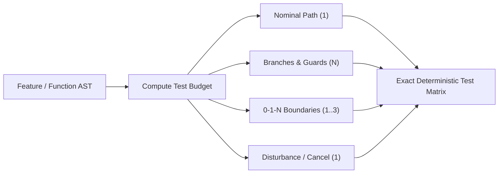
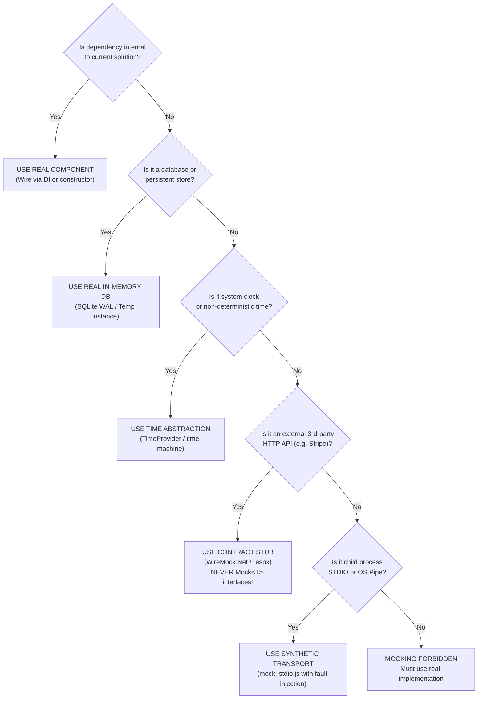

# 🏛️ Architecture & Specification: Anti-Test-Theatre Guardrails & Representative Testing

**Date:** 2026-09-29  
**Author:** Steven T. Pelech & Antigravity  
**Status:** Approved  
**Branch:** `feature/testGuardrails`  

---

## 1. Executive Summary

This specification codifies comprehensive **Anti-Test-Theatre Guardrails** across the **Agentic Engineering Toolbelt** repository (`AgenticEngineeringToolbelt`) and its downstream templates.

### The Problem: Test Theatre in AI-Assisted and Modern Engineering
In AI-assisted and fast-paced development environments, automated test suites often degrade into **"Test Theatre"**:
- **Mock-Heavy Tautologies**: Agents construct elaborate mocks of internal domain interfaces. Tests verify that mocks were invoked rather than asserting that system state mutated correctly.
- **Coverage Chasing Without Representation**: Suites achieve $\ge$ 80% line coverage by asserting trivial constructors, property getters/setters, and superficial happy paths while missing real-world boundary failures.
- **Fragile Scaffolding vs. Real Deficiencies**: Tests break whenever implementation details refactor, yet fail to catch critical regressions that developers discover immediately upon dogfooding.

### The Solution: Observable Systems & Representative Verification
This specification eliminates test theatre by establishing:
1. **The Four Pillars of Anti-Test Theatre**: Core engineering principles mandating real in-memory implementations, observable state assertions, automated dogfooding, and value-over-percentage coverage.
2. **12-Dimension Banned vs. Mandated Patterns Matrix**: Explicit rules that classify common testing shortcuts as banned theatre and specify mandated engineering alternatives.
3. **Deterministic Testing Protocols**: Mathematical algorithms for agents to compute exact test budgets (Basis Path + 0-1-N Boundary Rule) and evaluate dependency isolation (5-Question Mock Tree).
4. **Polyglot Archetype Test Harness Recipes**: Copy-pasteable test harnesses for .NET 10, Python 3.12+, React + Vite, and C++20/23 that execute against real databases, HTTP pipelines, and processes.
5. **Tooling & CI Quality Gates**: Static analysis heuristics in `verify_release.py` and GitHub Actions workflows to detect and flag mock-heavy test suites.

---

## 2. The Four Pillars of Anti-Test Theatre

```mermaid
flowchart TD
    subgraph P1["Pillar 1: Real Over Mock"]
        direction TB
        R1["Real In-Memory DBs<br>(SQLite WAL / Ephemeral Instances)"]
        R2["Real DI Containers & Service Wiring"]
        R3["Strict Boundary Isolation<br>(Mocks ONLY at external 3rd-party edge)"]
    end

    subgraph P2["Pillar 2: Outcomes Over Calls"]
        direction TB
        O1["Observable State Deltas (DB rows, files)"]
        O2["Return Payloads & Invariant Enforcements"]
        O3["BANNED: Mock.Verify() as primary assertion"]
    end

    subgraph P3["Pillar 3: Representative Dogfooding"]
        direction TB
        D1["Full HTTP Pipeline Roundtrips"]
        D2["Real CLI Subprocess Execution"]
        D3["Playwright E2E User Journeys"]
    end

    subgraph P4["Pillar 4: Value Over Vanity"]
        direction TB
        V1["Basis Path & Boundary Sweeps (0-1-N)"]
        V2["Synthetic Disturbance Ingestion"]
        V3["BANNED: Testing trivial POCOs for % metrics"]
    end

    P1 --> RealSystem["Deterministic, High-Confidence Software"]
    P2 --> RealSystem
    P3 --> RealSystem
    P4 --> RealSystem
```



### 2.1 Pillar 1: Real Implementations Over Synthetic Mocks ("Real Over Mock")
- Test software using real components and authentic in-memory equivalents rather than synthetic mocks.
- Use SQLite in WAL mode with real schema migrations and Dapper queries instead of mocking `IRepository<T>` or `DbContext`.
- **Strict Boundary Rule**: Mocking is strictly prohibited for internal domain services, business logic, and local storage. Mocks are permitted **only** at unmanageable external third-party network boundaries (e.g., Stripe, SendGrid, external identity providers) where local containers or recorded stubs are unavailable.

### 2.2 Pillar 2: Observable State & Behavioral Assertions ("Outcomes Over Calls")
- Assertions must evaluate observable outcomes: updated database records, generated files, API response payloads, emitted domain events, or state machine transitions.
- **Banned Assertion**: Verifying mock invocation counts (such as `mock.Verify(x => x.Save(), Times.Once)`) as the primary proof of functionality is classified as test theatre. If data changed, assert the change in the data store.

### 2.3 Pillar 3: Mandatory Representative Dogfooding & Smoke Loops ("Eat Your Own Food")
- Every feature must incorporate a representative end-to-end journey or CLI/API roundtrip before an agent or developer claims completion.
- If an agent builds a CLI command, the test harness must execute that CLI command via a real subprocess against temporary files. If an agent builds an API endpoint, it must execute a full HTTP request-response cycle through the entire middleware stack.

### 2.4 Pillar 4: Value-Driven Testing Over Numeric Vanity ("Stress Over Percentage")
- High line-coverage numbers achieved by testing trivial POCO properties, record constructors, or mock setups provide false confidence.
- Prioritize boundary conditions, edge cases, synthetic disturbances (socket disconnects, malformed inputs, timeouts), and concurrency over shallow line coverage.

---

## 3. Banned vs. Mandated Patterns Matrix (12 Engineering Dimensions)

| Dimension | 🚫 Banned Anti-Pattern (Test Theatre) | ✅ Mandated Engineering Standard (Real Verification) |
| :--- | :--- | :--- |
| **1. Data Access & Persistence** | • Mocking `IRepository<T>` or `DbContext` using Moq/unittest.mock to return hardcoded arrays.<br>• Testing SQL queries by asserting that `ExecuteAsync` was called with a specific string.<br>• Ignoring actual database constraints (foreign keys, nullability, unique indexes, transactions). | • Execute real Dapper queries / migrations against an in-memory SQLite (WAL mode) database or ephemeral test instance.<br>• Assert database state transitions directly (insert, mutate, query back, verify constraints and rollback behavior). |
| **2. Service Wiring & Composition** | • Constructing service classes with 6+ mocked constructor parameters (`new OrderService(mockRepo.Object, mockCalc.Object, mockNotifier.Object...)`).<br>• Verifying internal method call chains rather than component behavior. | • Wire real dependencies through the application's actual DI container (e.g. `ServiceCollection` / `TestServiceProvider`).<br>• Exercise the aggregate root / domain workflow end-to-end; verify system state deltas. |
| **3. Assertion Quality & Semantics** | • Asserting mock invocations as the sole proof of success (`mock.Verify(x => x.Publish(It.IsAny<Event>()), Times.Once)`).<br>• Vague assertions (`Assert.NotNull(result)`, `len(items) > 0`, `res.status_code != 500`).<br>• Tautological assertions where the expected output is calculated using the exact same buggy helper as the subject under test. | • Assert concrete state and schema invariants (`Assert.Equal("Shipped", order.Status)`, exact payload diffs).<br>• Use the 6-Part Feedback Envelope to capture exact `output_delta` when expectations fail.<br>• Verify observable side effects (events emitted into in-memory channels, DB rows committed). |
| **4. HTTP & Web APIs** | • Instantiating API Controller / Endpoint classes directly with `new ApiController(mocks...)` and calling action methods like plain functions.<br>• Mocking middleware, authentication filters, or model validation.<br>• Skipping JSON serialization/deserialization cycles. | • Execute full HTTP roundtrips using `WebApplicationFactory<Program>` (.NET) or `httpx.AsyncClient(app=app)` (Python).<br>• Validate through the complete middleware stack: routing, model binding, auth handlers, JSON serializers, error handling. |
| **5. CLI & Console Applications** | • Mocking `Console.ReadLine` / `sys.stdin` with `StringReader` or fake memory streams.<br>• Asserting that a command class returned exit code 0 without inspecting output files or state. | • Execute real CLI binaries/commands via subprocess execution or `System.CommandLine` test invocation against isolated temporary workspace fixtures.<br>• Assert exact exit codes, stdout/stderr formatting, and filesystem side-effects. |
| **6. Async, Channels & Daemons** | • Using `Thread.Sleep(500)` or `asyncio.sleep(1)` to "wait and hope" a background worker finishes.<br>• Mocking `Channel<T>` or background workers out of the test loop completely. | • Use deterministic synchronization primitives (`Channel<T>.Reader.WaitToReadAsync`, `ManualResetEventSlim`, or polling with a strict timeout and cancellation token).<br>• Drain in-memory queues and verify worker processing, retry, and cancellation token cleanup. |
| **7. Error Handling & Fault Injection** | • Writing happy-path-only tests where errors are never simulated.<br>• Testing exception handling by forcing a mock to throw an exception that the real system would never produce (e.g. mock throws generic `Exception` instead of realistic socket timeout). | • Inject synthetic disturbances: malformed JSON payloads, abrupt process termination (`mock_stdio.js`), socket timeouts, and invalid auth tokens.<br>• Verify graceful degradation, standardized error payloads, and audit log generation. |
| **8. Test Data & Fixtures** | • Randomly generated, uncontrolled test data that produces non-deterministic flaky failures.<br>• Massive, fragile 1,000-line JSON fixtures with 90% unused data copied across test files. | • Use deterministic, minimal test data builders / factories with explicit random seeds.<br>• Only specify fields relevant to the specific test scenario; use sensible, valid domain defaults for the rest. |
| **9. Trivial & Boilerplate Testing** | • Testing auto-implemented properties, C# record constructors, DTO getters/setters, or enum conversions purely to boost line coverage.<br>• Writing 20 tests for a 1-line pass-through function. | • Do not write tests for boilerplate POCOs, DTOs, or auto-properties.<br>• Focus testing budgets strictly on domain logic, calculation rules, edge cases, state transitions, and integration boundaries. |
| **10. UI & Frontend Verification** | • Shallow unit testing of React components using Jest/Vitest where every sub-component and hook is mocked to an empty `<div>`.<br>• Snapshot testing massive DOM trees that developers blindly update (`-u`) when they break. | • Run Playwright E2E journey tests against the real running frontend and backend.<br>• Enforce the 4-point `playwright-layout-inspector` audit (zero layout overflow, mobile fit, $\ge$ 24px touch targets, layout score $\ge$ 85). |
| **11. Configuration & Environments** | • Hardcoding environment variables or mocking `IConfiguration` with fake dictionary Lookups in memory.<br>• Tests that only pass on the author's local machine because they depend on local file paths. | • Test configuration binding using real appsettings/`.env` loading with temporary isolated environment overlays.<br>• Verify fallback behavior when required configuration keys are absent or invalid. |
| **12. Third-Party Network Boundaries** | • Mocking third-party APIs by hand-rolling complex mock behaviors that drift away from real API contracts.<br>• Letting tests make real outbound network requests to live third-party services. | • Use WireMock (.NET) or `respx` / `vcrpy` (Python) to replay recorded HTTP interactions or strictly validate request contracts.<br>• Restrict mocking strictly to external network edges; never use mocks for internal service boundaries. |

---

## 4. Deterministic Testing Algorithms for AI Agents

To eliminate guesswork and subjective choices, agents follow two mechanical algorithms before authoring test suites.

### 4.1 Deterministic Test Budget Formula
Agents analyze the function or feature Abstract Syntax Tree (AST) to compute the exact required test suite budget:

$$\text{Test Budget} = \text{Nominal (1)} + N_{\text{Decision Branches}} + N_{\text{0-1-N Boundaries}} + N_{\text{Disturbances}}$$

1. **Nominal Path ($= 1$)**: Exactly one test exercising the happy path with valid nominal data.
2. **Decision & Guard Branches ($= N_{\text{branches}}$)**: Exactly one test per independent branch (`if`, `switch`, validation guard, explicit `throw`).
3. **0-1-N Boundary Conditions ($= 1 \text{ to } 3$)**:
   - `0`: Empty collection, null parameter, or zero value.
   - `1`: Single element or minimum boundary threshold.
   - `N`: Large collection, maximum boundary, or page limit.
4. **Disturbances / Lifecycle ($= 1$ if async or I/O)**:
   - For async methods: exactly one test validating cancellation token propagation or timeout recovery.
   - For state mutations: exactly one test validating idempotency.



### 4.2 Deterministic 5-Question Mock Decision Tree
Before creating any mock or stub, agents pass the target dependency through this decision tree:



---

## 5. Polyglot Archetype Test Harness Recipes

### 5.1 C# (.NET 10) Fullstack & CLI

#### Web API Integration Harness (`WebApplicationFactory` + In-Memory SQLite)
```csharp
public class ApiIntegrationTestBase : WebApplicationFactory<Program>
{
    private SqliteConnection _keepAliveConnection;

    protected override void ConfigureWebHost(IWebHostBuilder builder)
    {
        builder.ConfigureServices(services =>
        {
            var descriptor = services.SingleOrDefault(d => d.ServiceType == typeof(IDbConnectionFactory));
            if (descriptor != null) services.Remove(descriptor);

            _keepAliveConnection = new SqliteConnection("Data Source=:memory:;Mode=Memory;Cache=Shared");
            _keepAliveConnection.Open();

            services.AddSingleton<IDbConnectionFactory>(new SqliteConnectionFactory(_keepAliveConnection));

            var sp = services.BuildServiceProvider();
            var migrator = sp.GetRequiredService<IDatabaseMigrator>();
            migrator.MigrateUp();
        });
    }

    protected override void Dispose(bool disposing)
    {
        _keepAliveConnection?.Dispose();
        base.Dispose(disposing);
    }
}
```

#### CLI Execution Fixture
```csharp
public class CliExecutionHarness : IDisposable
{
    public string TempWorkspace { get; } = Path.Combine(Path.GetTempPath(), Path.GetRandomFileName());

    public CliExecutionHarness() => Directory.CreateDirectory(TempWorkspace);

    public async Task<(int ExitCode, string StdOut, string StdErr)> ExecuteAsync(params string[] args)
    {
        var psi = new ProcessStartInfo("dotnet", string.Join(" ", args))
        {
            WorkingDirectory = TempWorkspace,
            RedirectStandardOutput = true,
            RedirectStandardError = true
        };
        using var proc = Process.Start(psi)!;
        var stdout = await proc.StandardOutput.ReadToEndAsync();
        var stderr = await proc.StandardError.ReadToEndAsync();
        await proc.WaitForExitAsync();
        return (proc.ExitCode, stdout, stderr);
    }

    public void Dispose() => Directory.Delete(TempWorkspace, recursive: true);
}
```

### 5.2 Python (3.12+) FastAPI & FastMCP

#### ASGI In-Memory Transport with SQLite
```python
import pytest
from httpx import ASGITransport, AsyncClient
from app.main import app
from app.database import init_db

@pytest.fixture
async def client(tmp_path):
    test_db = f"sqlite+aiosqlite:///{tmp_path}/test.db"
    await init_db(test_db)
    
    transport = ASGITransport(app=app)
    async with AsyncClient(transport=transport, base_url="http://test") as ac:
        yield ac
```

#### FastMCP In-Memory Session Client
```python
import pytest
from mcp.client.inmemory import InMemorySessionClient
from app.mcp_server import mcp

@pytest.mark.asyncio
async def test_mcp_tool_execution():
    async with InMemorySessionClient(mcp) as session:
        result = await session.call_tool("calculate_metrics", arguments={"sample_rate": 100})
        assert result.content[0].text is not None
        assert "convergence_score" in result.content[0].text
```

### 5.3 React + TypeScript (Vite)

#### Playwright E2E User Journey & Layout Inspection
```typescript
import { test, expect } from '@playwright/test';
import 'playwright-layout-inspector/matchers';

test.describe('Order Management User Journey', () => {
  test('operator can submit order and view updated table', async ({ page }) => {
    await page.goto('/');

    await page.getByTestId('sku-input').fill('SKU-999');
    await page.getByTestId('quantity-input').fill('10');
    await page.getByTestId('submit-order-btn').click();

    const row = page.getByTestId('order-row-SKU-999');
    await expect(row).toBeVisible();
    await expect(row.getByTestId('order-status')).toHaveText('Pending');

    // 4-Point Ergonomics & Layout Audit
    await expect(page).toHaveNoLayoutOverflow();
    await expect(page).toHaveMobileFit();
    await expect(page).toHaveTouchFriendlyTargets({ minSize: 24 });
    await expect(page).toPassLayoutAudit({ minScore: 85 });
  });
});
```

### 5.4 C++ (C++20/23) Native Algorithms

#### Parameter Sweeps & Boundary Stress Harness
```cpp
#include <gtest/gtest.h>
#include "numerical_solver.hpp"

class SolverBoundaryTest : public ::testing::TestWithParam<std::tuple<double, double, int>> {};

TEST_P(SolverBoundaryTest, ConvergesWithinToleranceUnderDisturbance) {
    auto [initial_value, learning_rate, max_iterations] = GetParam();
    
    SolverConfig config{.lr = learning_rate, .max_iter = max_iterations};
    NumericalSolver solver(config);

    auto result = solver.Solve(initial_value);

    EXPECT_TRUE(result.converged);
    EXPECT_LT(std::abs(result.residual), 1e-6);
    EXPECT_LE(result.iterations_taken, max_iterations);
}

INSTANTIATE_TEST_SUITE_P(
    BoundarySweeps,
    SolverBoundaryTest,
    ::testing::Combine(
        ::testing::Values(-1e5, -1.0, 0.0, 1.0, 1e5),
        ::testing::Values(0.001, 0.01, 0.1),
        ::testing::Values(10, 100, 1000)
    )
);
```

---

## 6. Verification Tooling & CI Quality Gates

### 6.1 Static Test Theatre Audit in `templates/scripts/verify_release.py`
We introduce an `--audit-tests` flag to `verify_release.py`:
1. **Mock-to-Assertion Ratio**: Scans test files for mock setup/verification invocations (`.Verify(`, `assert_called_with`, `mock.patch`) versus concrete state assertions (`Assert.Equal`, `assert ==`, `expect(`). Flags files where mock verifications exceed state assertions.
2. **Missing Integration Baseline**: Inspects repositories containing test suites. If unit test files use mock frameworks but no integration harness exists (`WebApplicationFactory`, `AsyncClient`, `Playwright`, or CLI runner), the audit fails or issues a warning.
3. **Tautological Assertion Scan**: Scans for assertions comparing variables to themselves (`Assert.Equal(x, x)`) or verifying mock calls as sole test assertions.

### 6.2 GitHub Actions Tier 2 CI Integration
Update `templates/workflows/ci.yml` and `.github/workflows/ci.yml` to execute:
```bash
python3 templates/scripts/verify_release.py --audit-tests
```
during the Tier 2 quality gate before allowing pull request merges.

---

## 7. Affected Files & Artifacts

| Component | Target Files | Changes |
| :--- | :--- | :--- |
| **Agent Rules** | `rules/AGENTS.md`<br>`rules/CLAUDE.md`<br>`rules/GEMINI.md` | Add Anti-Test-Theatre section, Banned vs. Mandated table summary, and deterministic testing protocols. |
| **Standards** | `standards/TESTING_HARNESS_PATTERNS.md`<br>`standards/ENGINEERING_STYLE_GUIDE.md` | Expand Section 2 with 4 Pillars, 12-dimension matrix, test budget formula, mock tree, and archetype recipes. |
| **Skills** | `.agents/skills/test-harness-builder/SKILL.md`<br>`.agents/skills/engineering-archetype/SKILL.md` | Embed deterministic budget calculation and mock decision tree into agent instructions. |
| **Archetypes** | `archetypes/fullstack-dotnet-react.md`<br>`archetypes/console-cli-dotnet.md`<br>`archetypes/python-fastapi-mcp.md`<br>`archetypes/react-ts-vite-ui.md`<br>`archetypes/native-cpp-algorithms.md` | Update testing sections with representative dogfood harness recipes. |
| **Scripts & CI** | `templates/scripts/verify_release.py`<br>`templates/workflows/ci.yml`<br>`.github/workflows/ci.yml` | Implement `--audit-tests` check and wire into CI quality gate. |
| **Living Docs** | `docs/standards/testing-harness-patterns.md`<br>`docs/rules/agents.md`<br>`docs/archetypes/*` | Synchronize all documentation into VitePress site. |
