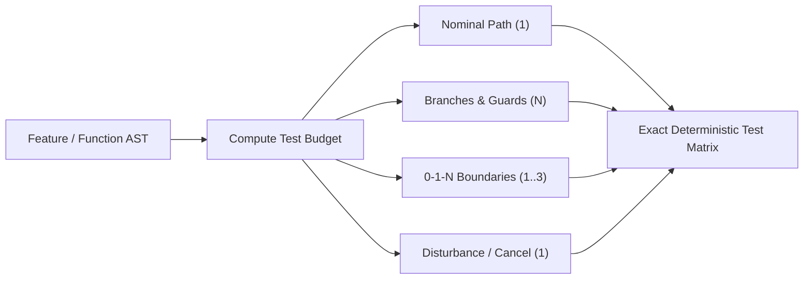
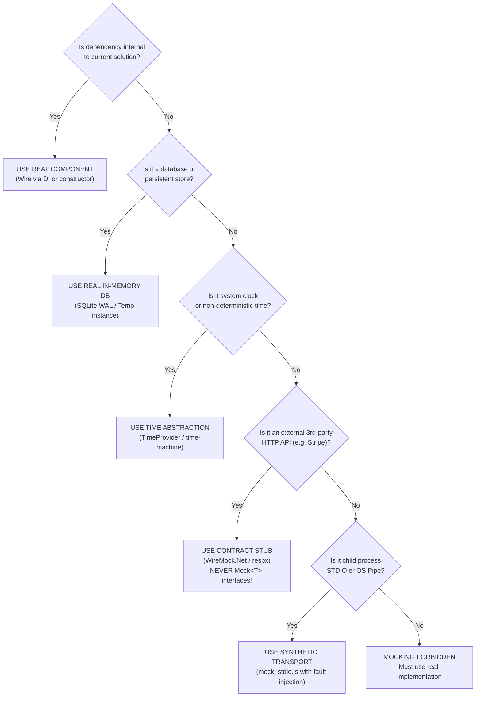

# 🤖 Universal AGENTS.md

Mandatory architectural guidelines and execution rules for AI coding assistants.

---

## 🤝 1. Collaboration & Workflow Discipline

1. **Proactive Clarifying Questions**: Steven's conceptual designs evolve during development. **Always ask insightful clarifying questions** to nail down requirements, edge cases, and architectural constraints.
2. **Traditional Git Flow Discipline**:
   - `main`: Production tagged releases only (`vX.Y.Z`). Every commit represents a verified release. Direct pushes are protected and forbidden.
   - `develop`: Primary integration branch for ongoing work. Feature branches merge here through Pull Requests.
   - `feature/*`: Dedicated branches created off `develop` (`feature/feature-name`). Contains isolated unit and functional work. Merges back to `develop` after Tier 2 and Tier 3 gates pass.
   - `release/*`: Created off `develop` (`release/vX.Y.Z`) when features freeze for an upcoming release. Dedicated to version bumping, changelog finalization, and release verification. Merges into `main` (with release tag) and syncs back to `develop`.
   - `hotfix/*`: Created directly off `main` (`hotfix/vX.Y.Z`) to address critical production defects. Merges into both `main` (with release tag) and `develop`.
   - Create **atomic Conventional Commits** (`feat:`, `fix:`, `test:`, `docs:`, `chore:`).
   - Features must culminate in a PR passing all 4-stage CI quality gates before merging.
3. **Living Documentation & ASD-STE100**:
   - Write all user-facing documentation, README files, architectural specs, and living guides adhering strictly to **ASD-STE100 (Simplified Technical English)** principles:
     - Keep sentences short, concise, and direct ($\le$ 20-25 words per sentence).
     - Use active voice and imperative mood for instructions.
     - Eliminate ambiguous jargon, colloquialisms, and redundant synonyms; maintain one core instruction per sentence.
   - Render architecture, sequence, state, and Git branching diagrams using native **Mermaid syntax** (`flowchart TD`, `sequenceDiagram autonumber`, `stateDiagram-v2`, `gitGraph`).
   - Host and publish project living documentation via **VitePress** deployed to GitHub Pages.
4. **APIs First, MCP Later**:
   - Domain logic and workflows must reside in clean, fully typed, self-contained libraries and REST/gRPC APIs before exposing them via Model Context Protocol (MCP).
   - MCP tools act strictly as lightweight wrappers that forward requests to underlying service interfaces.
   - Core capabilities must remain 100% testable and operable through CLI, direct API calls, or unit test harnesses without requiring MCP.
5. **Container Immutability**:
   - **NEVER** edit files or hot-patch code inside live running containers.
   - Always build/pull official images or rebuild via standard compose commands (`docker compose up -d --build`).
6. **Container Target Architecture**:
   - Standardize strictly on native `linux/amd64` for all container builds and CI workflows.
   - **DO NOT** include QEMU emulation or multi-architecture (`arm64`) build steps in CI/CD pipelines.

---

## 🏛️ 2. Core Code & Architectural Discipline

1. **SOLID & Single Responsibility**: Decompose files and classes exceeding **500 lines of code** into partial classes or focused sub-services.
2. **Interfaces by Default**: Build client-focused interfaces (`I*` in C#) even for single implementations to ensure loose coupling and testability.
3. **DRY vs YAGNI**:
   - **Rule of Three**: Duplication is acceptable across 2 instances; abstract on the 3rd occurrence.
   - Do not invent speculative multi-tier frameworks (YAGNI).
4. **Semantic Naming**:
   - **Banned**: `*Manager`, `*Helper`, `*Util`, `*Data` junk drawers.
   - **Enforced**: Role/action-based names (`DatabaseSeederService`, `UserAuthenticator`, `ServerStatusCard`, `use*Store.ts`).
5. **Efficiency**:
   - **Database**: If an operation requires 3+ database round-trips or complex multi-table joins, consolidate into a single **Stored Procedure** (`.sql` file) or multi-result query.
   - **Frontend**: Mandatory **granular Zustand selectors** (`useServerStore(s => s.servers.length)`) to prevent render cascades.
6. **Error Handling & Diagnostics**:
   - Never leak raw stack traces to API clients.
   - Capture rich debug logs with the exact inputs and state that caused the error.

---

## 💻 3. Polyglot Language Matrix

- **C# (.NET 10)**: `.slnx`, `System.CommandLine`, full DI, Dapper + Stored Procs (separate `.sql` files), SQLite WAL (MySQL-compatible) / MSSQL, native C# UIs (WPF/WinForms/Avalonia, no Electron), full `CancellationToken` propagation.
- **Python (3.12+)**: `uv`, `pyproject.toml`, FastAPI + FastMCP, Pydantic v2 schemas, `asyncio`, `pytest` ($\ge$ 80% coverage), `ruff`.
- **TypeScript / React**: React + TS strict + Vite, Zustand domain stores, pure CSS Modules + custom properties, bespoke components, `playwright-layout-inspector` 4-point audit.
- **C++ (C++20/23)**: MSBuild (Win) / CMake (Linux), `vcpkg`, strict RAII, smart pointers, GoogleTest (`gtest`), ASan/UBSan, Benchmark, C# `[LibraryImport]` / Python `pybind11` interop.

---

## 🧪 4. Testing & Agent Verification Protocol

1. **Software as an Observable Dynamic System**:
   - Model critical workflows, boundary crossings, and stateful protocols with diagnostic tap points, metrics, and health probes.
   - Build closed-loop simulation harnesses with high-volume testing loops, parameter sweeps, and synthetic disturbance ingestion.
2. **Tiered Testing Cadence ("Test When It Makes Sense")**:
   - **Tier 1 (Inner Loop / Rapid Dev)**: Fast, isolated in-memory unit tests on demand. No mandatory test suite runs during early exploratory prototyping or drafting.
   - **Tier 2 (Stabilization Gate / Pre-Manual Verification)**: Run unit test suites and targeted integration tests once feature interfaces and domain boundaries stabilize, immediately prior to developer or agent manual testing.
   - **Tier 3 (Pre-PR / Pre-Release / CI Quality Gate)**: Full test matrix, multi-provider integration tests, simulation stress loops, and Playwright layout audits run before merging to `develop`/`main` and in CI.
3. **Anti-Test Theatre & Representative Verification**:
   - AI agents and developers must never write **Test Theatre**. Test theatre means mock-heavy tests that verify method calls instead of real system state.
   - Adhere strictly to the **Four Pillars of Anti-Test Theatre**:
     - **Pillar 1: Real Over Mock**:
       - Test software with real components and authentic in-memory equivalents.
       - Use in-memory SQLite (WAL mode) or ephemeral test databases instead of mocking `IRepository<T>` or `DbContext`.
       - **Strict Boundary Rule**: Never mock internal domain services, business logic, or local storage.
       - Mock only unmanageable external third-party network boundaries (for example, Stripe or SendGrid).
     - **Pillar 2: Outcomes Over Calls**:
       - Assertions must evaluate observable outcomes: updated database records, generated files, return payloads, or domain events.
       - **Banned Assertion**: Never use mock invocation counts (such as `mock.Verify(x => x.Save(), Times.Once)`) as primary proof of success.
       - Assert state mutations directly in the target data store.
     - **Pillar 3: Representative Dogfooding & Smoke Loops**:
       - Every feature requires a representative end-to-end journey or CLI/API roundtrip before claiming completion.
       - If you build a CLI command, execute that CLI command via a real subprocess against a temporary workspace.
       - If you build an API endpoint, execute a full HTTP request-response cycle through the complete middleware stack.
     - **Pillar 4: Value Over Numeric Vanity**:
       - High line-coverage numbers from testing trivial POCOs, record constructors, or getters and setters provide false confidence.
       - Prioritize boundary conditions, edge cases, synthetic disturbances, and concurrency over shallow line coverage.
       - Do not write tests for boilerplate POCOs, DTOs, or auto-properties.
   - Review the complete 12-dimension matrix and polyglot recipes in [**TESTING_HARNESS_PATTERNS.md**](../standards/TESTING_HARNESS_PATTERNS.md).

```mermaid
flowchart TD
    subgraph P1["Pillar 1: Real Over Mock"]
        direction TB
        R1["Real In-Memory DBs<br>(SQLite WAL / Ephemeral)"]
        R2["Real DI Containers & Service Wiring"]
        R3["Strict Boundary Isolation<br>(Mocks ONLY at 3rd-party edge)"]
    end

    subgraph P2["Pillar 2: Outcomes Over Calls"]
        direction TB
        O1["Observable State Deltas (DB rows, files)"]
        O2["Return Payloads & Invariants"]
        O3["BANNED: Mock.Verify() as primary assertion"]
    end

    subgraph P3["Pillar 3: Representative Dogfooding"]
        direction TB
        D1["Full HTTP Pipeline Roundtrips"]
        D2["Real CLI Subprocess Execution"]
        D3["Playwright E2E User Journeys"]
    end

    subgraph P4["Pillar 4: Value Over Vanity"]
        direction TB
        V1["Basis Path & Boundary Sweeps (0-1-N)"]
        V2["Synthetic Disturbance Ingestion"]
        V3["BANNED: Testing trivial POCOs for % metrics"]
    end

    P1 --> RealSystem["Deterministic, High-Confidence Software"]
    P2 --> RealSystem
    P3 --> RealSystem
    P4 --> RealSystem
```

4. **Deterministic Testing Protocols for Agents**:
   - **Deterministic Test Budget Formula**:
     - Analyze the function or feature Abstract Syntax Tree (AST) before authoring tests.
     - Compute the exact required test suite budget:
       $$\text{Test Budget} = \text{Nominal (1)} + N_{\text{Branches}} + N_{\text{0-1-N Boundaries}} + N_{\text{Disturbances}}$$
       - **Nominal Path ($= 1$)**: Exactly one test exercising the happy path with valid nominal data.
       - **Decision & Guard Branches ($= N_{\text{Branches}}$)**: Exactly one test per independent branch (`if`, `switch`, validation guard, explicit `throw`).
       - **0-1-N Boundary Conditions ($= 1 \text{ to } 3$)**:
         - `0`: Empty collection, null parameter, or zero value.
         - `1`: Single element or minimum boundary threshold.
         - `N`: Large collection, maximum boundary, or page limit.
       - **Disturbances / Lifecycle ($= 1$ if async or I/O)**:
         - For async methods: exactly one test validating cancellation token propagation or timeout recovery.
         - For state mutations: exactly one test validating idempotency.

   - **Deterministic 5-Question Mock Decision Tree**:
     - Pass every candidate dependency through this 5-question tree before creating any mock or stub:
       1. **Is the dependency internal to the current solution?** If yes, use the real component via DI or direct instantiation.
       2. **Is it a database or persistent store?** If yes, use a real in-memory database (SQLite WAL or ephemeral instance).
       3. **Is it system clock or non-deterministic time?** If yes, use a time abstraction (`TimeProvider` or time-machine).
       4. **Is it an external 3rd-party HTTP API (e.g., Stripe, SendGrid)?** If yes, use a contract stub (`WireMock.Net` or `respx`). Never mock internal interfaces!
       5. **Is it child process STDIO or an OS pipe?** If yes, use synthetic transport (`mock_stdio.js`) with fault injection.
       - If you answer "No" to all five questions, **mocking is forbidden**. Use the real implementation.

5. **Coverage Target**: Maintain $\ge$ 80% code coverage across unit, integration, and E2E suites. Do not count boilerplate or trivial POCO tests toward this goal.
6. **UI Layout Inspection**: Frontends must pass the 4-point `playwright-layout-inspector` audit (no overflow, mobile fit, $\ge$ 24px targets, $\ge$ 85 score) with `data-testid` attributes.
7. **6-Part Agent Feedback Envelope**: Format harness/test failures using the standardized diagnostic envelope: (1) `inputs`, (2) `assumptions`, (3) `active_settings`, (4) `action_history`, (5) `output_delta`, and (6) `captured_logs`, along with deterministic `reproduction_command` metadata.
8. **Empirical Verification**: Never claim a task complete without running build, tests, verifying logs, and probing `/health`.
