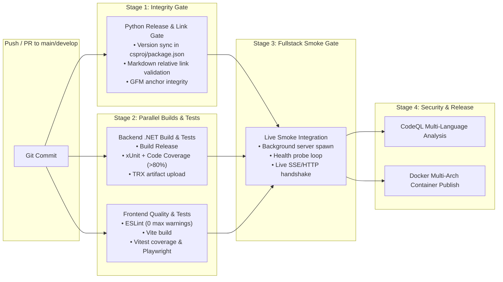

# 🚀 Multi-Stage GitHub Actions CI/CD Pipeline Blueprint

This document details the standardized 4-stage GitHub Actions CI/CD architecture deployed across projects.

---

## 🏛️ Pipeline Topology

---

## 📋 Stage Descriptions

### Stage 1: Release & Link Integrity Gate
Runs `scripts/verify_release.py` to ensure that:
- Version strings are synchronized across all project files (`.csproj`, `package.json`, `CHANGELOG.md`, `README.md`).
- All relative markdown links and anchor targets in `docs/` and root files resolve to real files and headers.

### Stage 2: Parallel Builds & Tests
- **Backend**: Restores solution (`.slnx`), builds in Release mode, and runs unit and integration tests with code coverage collection.
- **Frontend**: Installs dependencies (`npm ci`), runs strict ESLint (`--max-warnings 0`), builds the production bundle (`vite build`), and runs unit and layout tests.

### Stage 3: Fullstack Integration Smoke Gate
Spawns the built backend and frontend in the background, probes the `/health` endpoint until healthy, executes live SSE/HTTP handshakes, and terminates cleanly.

### Stage 4: Security & Release
- Runs **CodeQL** static analysis across C# and TypeScript codebases.
- Builds and publishes multi-architecture Docker containers to GitHub Container Registry (GHCR) upon successful main branch builds or semver tags.
