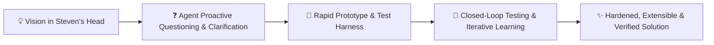
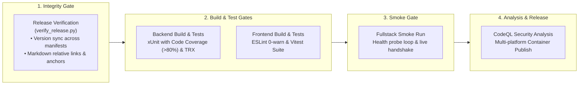

# 🏛️ Master Engineering Style Guide & Architecture Archetype

This document codifies the engineering principles, architectural patterns, tech stack standards, test harness conventions, and living documentation practices established across Steven T. Pelech's repositories.

---

## 🤝 1. Collaboration & Iterative Design Model



- **Vision & Exploration**: Steven drives the conceptual vision, architecture, and feature ideas. Because ideas start in his head and evolve, **part of the agent's primary job is to ask insightful clarifying questions** to flesh out requirements, edge cases, and design constraints before or during development.
- **Iterative Prototyping**: We build via rapid prototyping and closed-loop evaluation—prototyping early, running test harnesses, learning from live behavior, and refining architecture iteratively.
- **Git Branch & PR Workflow**:
  - All new features and significant plans start on a **fresh feature branch** off `develop` (or `main`/`master`).
  - Work is committed with **fine-grained, atomic commits** to keep history transparent and legible.
  - Features culminate in a **Pull Request (PR)** where all multi-stage CI quality gates must pass before merging.

---

## 🎯 2. Foundational Engineering Principles

1. **SOLID & DRY Design**: Heavy emphasis on Single Responsibility, Open/Closed extensibility, Interface Segregation, and Dependency Inversion. Avoid copy-paste and one-offs—structure components for reusability and pluggability. Break apart large files and multi-concern components into focused, cohesive modules.
2. **Relational SQL, Stored Procedures & Dapper**: Relational data modeling (SQLite WAL, MS SQL Server, MySQL) over NoSQL or heavy ORMs (like Entity Framework Core). Use **Dapper** / ADO.NET with **Stored Procedures** where appropriate (for access evaluation, audit logging, complex queries, and high-performance transactional logic) alongside clean parameterized queries and connection factories (`IDbConnectionFactory`).
3. **Controls, Modeling & Simulation Mindset (Harnesses & Closed-Loop Testing)**:
   - Rooted in a controls, modeling, and simulation background: systems are designed with deterministic state machines, simulated mock transports, and rich observability.
   - **Closed-Loop Testing**: Build test harnesses that execute against running systems, capture metrics/diagnostics, and provide feedback loops to continuously improve performance, accuracy, and UI stability.
   - Target **>80% code coverage** with meaningful unit, integration, and E2E tests.
4. **Pragmatic API Architecture & MCP Integration**:
   - Choose between **ASP.NET Core Controllers** (`[ApiController]`) for rich domain aggregates and **Minimal APIs** (`Map*Endpoints()`) for lightweight routing and streaming.
   - **MCP-First Consideration**: If a service exposes an API, the architecture should explicitly consider exposing a **Model Context Protocol (MCP) server** for AI agent integration where appropriate.
5. **Security & Encryption by Default**:
   - Encrypt sensitive data at rest and in transit (e.g. AES-256-GCM, DPAPI, SQLCipher, Vault secrets) where appropriate.
   - Apply authentication and authorization (OIDC/reverse proxy headers, AppKeys, RBAC) unless explicitly deemed unnecessary.
6. **LLM Integration Standard**:
   - Standardize on **LiteLLM / OpenAI SDK** compatibility for LLM integrations (handling OpenAI-compatible completions, embeddings, tool calling, and model switching).
7. **Automated Documentation & Release Workflows**:
   - Automate documentation generation (catalogs, schemas, API docs), version bumping, and release packaging wherever possible.
   - Living `ARCHITECTURE.md` with Mermaid diagrams. Requirements use clear narrative criteria by default; formal `REQ-xxx` prefixes are reserved for when formal ADR (Architecture Decision Record) catalogs are explicitly requested.

---

## 💻 3. Backend Architecture (Modern .NET / C#)

### 3.1 Project & Solution Conventions
- **Language & Runtime**: Modern .NET (C#) with `<Nullable>enable</Nullable>`, `<ImplicitUsings>enable</ImplicitUsings>`, and `<GenerateDocumentationFile>true</GenerateDocumentationFile>`.
- **Solution Management**: Prefer the modern `.slnx` solution format.
- **Solution Layout**:
  - `Components/` or `Controllers/`: Domain slices, feature controllers, and API endpoint definitions.
  - `Infrastructure/`: Persistence (`IDbConnectionFactory`, repositories, seeders), Transports, Identity, and Secrets.
  - `Core/`: Domain models, interfaces, thread-safe state managers, and protocol converters.
  - `[Project].Tests/`: Unit, integration, and mock transport test suites.

### 3.2 Persistence & Database Access (SQL, Stored Procedures, Dapper)
- **Database Backends**: SQLite (with WAL mode), MS SQL Server, and MySQL.
- **Access Patterns**:
  - **Stored Procedures**: Used for security/access evaluation (e.g. `sp_EvaluateUserAccess`), audit logging (`sp_InsertAuditLog`), batch updates, and high-performance transactional logic.
  - **Parameterized SQL via Dapper**: Used for clean, high-performance data mapping without the runtime overhead and hidden query generation of heavy ORMs.
  - **Connection Factory**: Pluggable `IDbConnectionFactory` providing open connections with proper WAL/pooling pragmas.
  - **Database Seeders**: Idempotent migration and initialization scripts (`DatabaseSeederService.cs`).

```csharp
// Example: Stored Procedure execution via Dapper
public async Task<bool> EvaluateUserAccessAsync(string userSid, string toolName, CancellationToken ct = default)
{
    using var conn = await _dbFactory.CreateConnectionAsync(ct);
    var parameters = new DynamicParameters();
    parameters.Add("@UserSid", userSid);
    parameters.Add("@ToolName", toolName);
    parameters.Add("@IsAuthorized", dbType: DbType.Boolean, direction: ParameterDirection.Output);

    await conn.ExecuteAsync(new CommandDefinition(
        "sp_EvaluateUserAccess",
        parameters,
        commandType: CommandType.StoredProcedure,
        cancellationToken: ct));

    return parameters.Get<bool>("@IsAuthorized");
}
```

### 3.3 API Routing: Controllers & Minimal APIs
- **Controllers**: Use `[ApiController]` and standard controller classes for rich domain aggregates, admin endpoints, and multi-action resources.
- **Minimal APIs**: Use route groups and `Map*Endpoints()` extensions for streaming transports, health probes, and simple vertical slices.

---

## 🎨 4. Frontend Architecture (React / TypeScript / Zustand / Vite)

### 4.1 Stack & Tooling
- **Core Framework**: React with TypeScript in strict mode (`"strict": true`, `"noUnusedLocals": true`).
- **Build Engine**: Vite for fast HMR and optimized production bundles.
- **State Management**: **Zustand** stores (`use*Store.ts`) with focused slices, action creators, and selector hooks to avoid unnecessary re-renders.
- **Styling & Theming**: Clean CSS custom properties and theme tokens with dark mode support. Avoid heavy, monolithic UI frameworks that pollute the DOM.
- **Code Quality**: Zero-warning linter policy (`eslint . --max-warnings 0`).

### 4.2 Zustand Store Pattern
```typescript
import { create } from 'zustand';

interface ServerState {
  servers: ServerModel[];
  isLoading: boolean;
  selectedServerId: string | null;
  fetchServers: () => Promise<void>;
  selectServer: (id: string | null) => void;
}

export const useServerStore = create<ServerState>((set, get) => ({
  servers: [],
  isLoading: false,
  selectedServerId: null,

  fetchServers: async () => {
    set({ isLoading: true });
    try {
      const res = await fetch('/api/servers');
      if (!res.ok) throw new Error(`HTTP ${res.status}`);
      const data = await res.json();
      set({ servers: data, isLoading: false });
    } catch (err) {
      set({ isLoading: false });
      console.error('Failed to fetch servers:', err);
    }
  },

  selectServer: (id) => set({ selectedServerId: id }),
}));
```

---

## 🧪 5. Testing, Test Harnesses & Closed-Loop Verification

### 5.1 Controls & Simulation Testing Pyramid (>80% Coverage Target)
1. **Unit Tests (xUnit + NSubstitute / Vitest + Happy-DOM)**:
   - In-memory execution testing business logic, input validation, and state transformations in isolation.
2. **Pairwise & Multi-Provider Integration Tests**:
   - Integration matrices validating combinations of database providers (SQLite, MSSQL, MySQL) and authentication mechanisms.
3. **Synthetic Mock Transports & Simulation Harnesses**:
   - Simulated transport processes (`mock_stdio.js`, mock SSE channels, stream injectors) to test connection failures, message interleaving, and cancellation tokens.
4. **E2E & Layout UX Audits (Playwright + Playwright Layout Inspector)**:
   - Full user journey testing across desktop and mobile viewports.
   - Automated layout regression and WCAG ergonomics assertions:
     ```typescript
     import { test, expect } from '@playwright/test';
     import 'playwright-layout-inspector/matchers';

     test('audit layout stability and mobile ergonomics', async ({ page }) => {
       await page.goto('/');
       await expect(page).toHaveNoLayoutOverflow();
       await expect(page).toHaveMobileFit();
       await expect(page).toHaveTouchFriendlyTargets({ minSize: 24 });
       await expect(page).toPassLayoutAudit({ minScore: 85 });
     });
     ```
5. **Closed-Loop Testing**:
   - Automated feedback loops that capture test output, diagnostic ring buffers, and performance telemetry to iteratively tune and verify systems before merging.

---

## 📑 6. Living Documentation & Architecture Standards

### 6.1 `ARCHITECTURE.md`
Every project contains an `ARCHITECTURE.md` document featuring:
1. **High-Level Topology**: Mermaid flowchart (`flowchart TD` / `graph TD`) illustrating client, API, service, and persistence layers.
2. **Message & Request Sequence Flows**: Step-numbered Mermaid sequence diagrams (`sequenceDiagram autonumber`).
3. **Subsystem & Boundary Breakdown**: Domain slice and folder responsibilities.
4. **Non-Functional SLAs**: Latency, concurrency, security, and PII sanitization guarantees.

### 6.2 Requirements & Architecture Decision Records (ADRs)
- Requirements are written with clear narrative acceptance criteria.
- Formal `REQ-xxx` prefixes are reserved for projects where formal Architecture Decision Records (ADRs) or requirement catalog matrices are explicitly used.

---

## 🚀 7. Multi-Stage GitHub Actions CI/CD Pipeline

Standard 4-stage pipeline deployed in `.github/workflows/ci.yml`:



---

## 🛠️ 8. Development Automation Scripts

- **`commit.sh`**: Validates backend compilation, runs automated version bumping, stages modified tracked files, and creates an atomic git commit.
- **`verify_release.py`**: Validates version synchronization across project files and verifies all relative markdown links and GFM anchors before releases.
