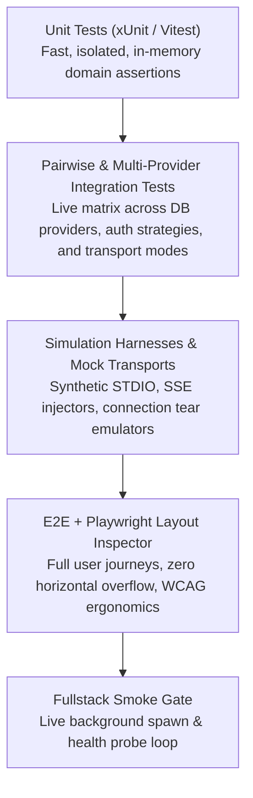

# 🧪 Controls, Modeling & Simulation Testing Patterns

This guide outlines the testing architecture, simulation harnesses, and closed-loop verification practices that ensure software stability, deterministic performance, and >80% code coverage.

---

## 🎯 The Controls Mindset in Software

A controls and modeling/simulation background approaches software as a **closed-loop dynamic system**:
1. **Observable States**: Systems expose clear metrics, health probes, and ring buffers.
2. **Synthetic Inputs & Disturbance Ingestion**: Test harnesses simulate imperfect real-world inputs (network drops, out-of-order JSON-RPC, corrupt streams).
3. **Closed-Loop Feedback**: Tests capture state responses, compute deltas/scores, and feed back assertions to drive rapid convergence on performance and accuracy.

---

## 🧱 1. The Multi-Tier Testing Pyramid



---

## ⚙️ 2. Mock Transports & Simulation Harnesses

### Synthetic STDIO Transport (`mock_stdio.js`)
Simulates a child process STDIO transport with controllable latency, stdout buffering, stderr emission, and abrupt process termination:

```javascript
// mock_stdio.js - Simulates asynchronous JSON-RPC communication
const readline = require('readline');
const rl = readline.createInterface({ input: process.stdin, output: process.stdout, terminal: false });

rl.on('line', (line) => {
  try {
    const req = JSON.parse(line);
    // Simulate processing delay
    setTimeout(() => {
      if (req.method === 'ping') {
        console.log(JSON.stringify({ jsonrpc: '2.0', id: req.id, result: 'pong' }));
      }
    }, 50);
  } catch (err) {
    process.stderr.write(`Malformed JSON: ${line}\n`);
  }
});
```

---

## 📐 3. UI Layout Stability & Ergonomics Auditing

Frontends integrate **`playwright-layout-inspector`** to catch subtle visual regressions, horizontal canvas bleeding, layout shifts, and touch target accessibility violations across mobile and desktop viewports:

```typescript
import { test, expect } from '@playwright/test';
import 'playwright-layout-inspector/matchers';

test.describe('Responsive Layout & Ergonomics Audit', () => {
  test('audit page layout across viewports', async ({ page }) => {
    await page.goto('/');

    // 1. Assert zero unwanted horizontal scrollbars or element bleed
    await expect(page).toHaveNoLayoutOverflow();

    // 2. Assert mobile viewport & zoom readiness
    await expect(page).toHaveMobileFit();

    // 3. Assert touch targets meet WCAG standards (≥ 24px/44px)
    await expect(page).toHaveTouchFriendlyTargets({ minSize: 24 });

    // 4. Assert overall layout UX score is Grade A
    await expect(page).toPassLayoutAudit({ minScore: 85 });
  });
});
```

---

## 🔄 4. Closed-Loop Test Verification

Before claiming any task or feature is complete:
1. Run automated tests against running processes.
2. Collect coverage and inspect failures.
3. Iteratively adjust implementation until all test suites pass with **>80% code coverage**.
