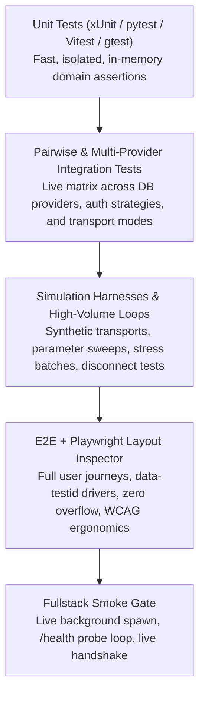

# 🧪 Controls, Modeling & Simulation Testing Patterns

This guide outlines the testing architecture, simulation harnesses, and closed-loop verification practices that ensure software stability, deterministic performance, and $\ge$ 80% code coverage.

---

## 🎯 1. The Controls Mindset in Software

A controls and modeling/simulation background approaches software as a **closed-loop dynamic system**:
1. **Observable States**: Systems expose clear metrics, health probes, and internal diagnostic tap points.
2. **High-Volume & Disturbance Ingestion**: Test harnesses simulate high-throughput stress, parameter sweeps, and imperfect real-world inputs (malformed payloads, abrupt disconnects).
3. **Closed-Loop Feedback**: Tests capture state responses, compute deltas, and feed back structured diagnostic envelopes to drive rapid agent self-correction.



---

## 🏗️ 2. When to Build a Dedicated Test Harness

An agent MUST create a dedicated test harness whenever:
1. **Crossing an Architectural Boundary**: An external API, database, child process STDIO, SSE stream, or network protocol is introduced.
2. **Implementing Tunable Algorithms**: Logic with variability, numeric convergence, thresholding, sorting, or scoring that requires parameter sweeping.
3. **Stateful Protocols & Daemons**: Background workers, queue consumers (`Channel<T>`), or multi-step transaction pipelines.

---

## ⚙️ 3. Harness Types & Simulation Patterns

### 3.1 High-Volume & Stress Loop Harness
Wraps the component under test in a high-volume execution loop feeding batches of synthetic or recorded inputs:

```csharp
// Example: High-Volume C# Closed-Loop Harness
public class HighVolumeSimulationHarness
{
    private readonly IProcessingEngine _engine;

    public async Task<HarnessResult> RunBatchAsync(int batchSize, CancellationToken ct)
    {
        var transitions = new List<StateTransition>();
        var sw = Stopwatch.StartNew();

        for (int i = 0; i < batchSize; i++)
        {
            var payload = GenerateSyntheticPayload(i);
            var result = await _engine.ProcessAsync(payload, ct);
            transitions.Add(new StateTransition(i, result.State, sw.ElapsedMilliseconds));
        }

        return new HarnessResult(batchSize, transitions, sw.Elapsed);
    }
}
```

### 3.2 Synthetic Mock Transports (`mock_stdio.js`)
Simulates child process STDIO with controllable latency, stdout buffering, stderr emission, and abrupt process termination:

```javascript
// mock_stdio.js - Simulates asynchronous JSON-RPC communication & disconnects
const readline = require('readline');
const rl = readline.createInterface({ input: process.stdin, output: process.stdout, terminal: false });

rl.on('line', (line) => {
  try {
    const req = JSON.parse(line);
    if (req.method === 'trigger_disconnect') {
      process.exit(1); // Abrupt crash to test reconnection
    }
    setTimeout(() => {
      if (req.method === 'ping') {
        console.log(JSON.stringify({ jsonrpc: '2.0', id: req.id, result: 'pong' }));
      }
    }, 50);
  } catch (err) {
    process.stderr.write(`Malformed JSON: ${line}\n`);
  }
});
```

### 3.3 Disturbance Injection
Inject failures specifically to test error fallbacks and graceful degradation:
- **Malformed Payloads**: Ingestion of corrupt JSON, truncated strings, invalid encodings.
- **Abrupt Disconnects**: Terminating child processes or socket streams mid-handshake to verify `CancellationToken` cleanup and retry logic.

---

## 🔍 4. Diagnostic Tap Points & Agent Introspection

### Development Tap Point Protocol
During development and debugging:
1. **Inject Hooks**: Agents inject internal diagnostic hooks (e.g. event subscriptions, state snapshot getters, in-memory ring buffers).
2. **Inspect Internals**: Test harnesses subscribe to these hooks to assert internal state transitions without relying on parsing unstructured text logs.
3. **Clean Up**: Remove or compile-guard debug hooks before production release.

---

## 📐 5. UI Layout Stability & Ergonomics Auditing

Frontends integrate **`playwright-layout-inspector`** with `data-testid` attributes to catch visual regressions and accessibility defects:

```typescript
import { test, expect } from '@playwright/test';
import 'playwright-layout-inspector/matchers';

test.describe('Responsive Layout & Ergonomics Audit', () => {
  test('audit page layout across viewports', async ({ page }) => {
    await page.goto('/');

    // 1. Assert zero unwanted horizontal scrollbars or element bleed
    await expect(page).toHaveNoLayoutOverflow();

    // 2. Assert mobile viewport & zoom readiness
    await expect(page).toHaveMobileFit();

    // 3. Assert touch targets meet WCAG standards (>= 24px)
    await expect(page).toHaveTouchFriendlyTargets({ minSize: 24 });

    // 4. Assert overall layout UX score is Grade A
    await expect(page).toPassLayoutAudit({ minScore: 85 });
  });
});
```

---

## 📋 6. The 6-Part Agent Feedback Envelope

When a test harness, integration test, or simulation loop fails, the failure output MUST be packaged in a standardized diagnostic envelope:

```json
{
  "status": "FAILED",
  "test_name": "Test_HighThroughput_OrderBatch_Convergence",
  "inputs": {
    "batch_size": 1000,
    "concurrency_limit": 16,
    "seed": 42
  },
  "assumptions": [
    "Database connection pool size >= 20",
    "Channel buffer capacity >= 500"
  ],
  "active_settings": {
    "journal_mode": "WAL",
    "synchronous": "NORMAL",
    "busy_timeout": 5000
  },
  "action_history": [
    { "step": 1, "action": "SpawnWorkerPool", "status": "OK" },
    { "step": 2, "action": "Enqueue500Items", "status": "OK" },
    { "step": 3, "action": "SimulateDisconnect", "status": "TRIGGERED" },
    { "step": 4, "action": "DrainChannel", "status": "TIMEOUT" }
  ],
  "output_delta": {
    "expected_processed": 500,
    "actual_processed": 482,
    "unprocessed_delta": 18
  },
  "captured_logs": [
    "ERROR [Worker-3] CancellationTokenSource timed out after 5000ms",
    "WARN [Pool] Connection dropped during transaction commit"
  ],
  "reproduction_command": "dotnet test --filter \"FullyQualifiedName=Harness.Test_HighThroughput\" -- --seed 42"
}
```
