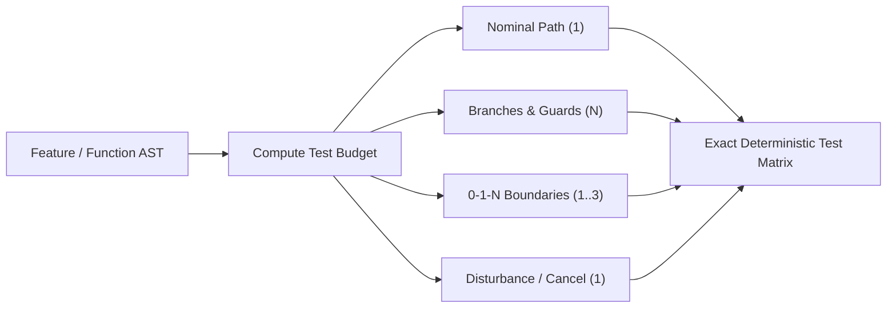
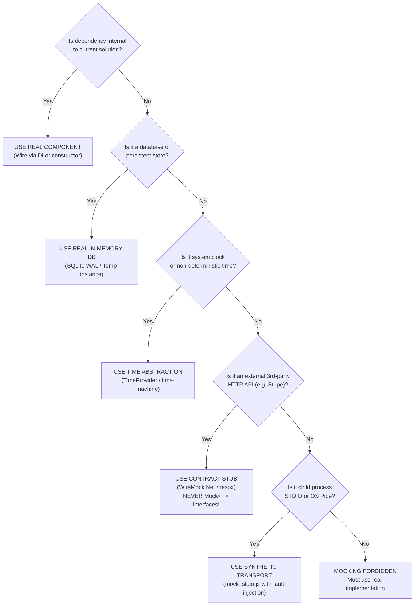
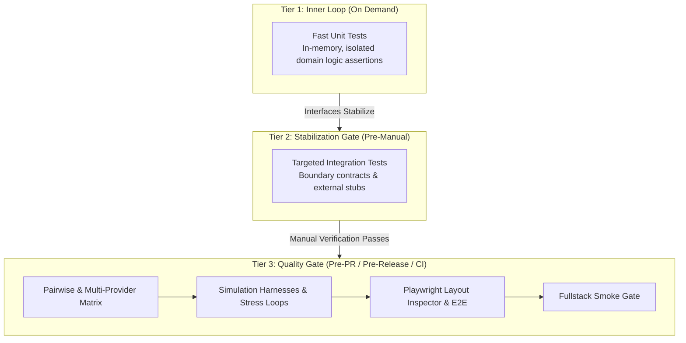

# 🧪 Simulation & Control Harnesses: Observation, Testing & Feedback for Developers and AI

This guide defines simulation architecture, test harness conventions, and closed-loop verification practices. These practices guarantee software stability, deterministic performance, and $\ge$ 80% code coverage.

---

## 🎯 1. Software as an Observable Dynamic System & The Four Pillars

### 1.1 Software as a Dynamic System

Software operates as a closed-loop dynamic system:
1. **Observable States**: Systems expose internal states through diagnostic tap points, metrics, and health probes.
2. **High-Volume & Parameter Sweeps**: Test harnesses simulate high-throughput stress, batch processing, and parameter sweeps to evaluate numeric stability and boundary limits.
3. **Disturbance Ingestion**: Systems process imperfect inputs, synthetic latency, and abrupt disconnects to prove graceful recovery.
4. **Closed-Loop Feedback**: Tests capture state responses, compute deltas, and return structured diagnostic envelopes for rapid developer and AI self-correction.

### 1.2 The Four Pillars of Anti-Test Theatre

In fast engineering environments, automated test suites often degrade into **"Test Theatre"**:
- **Mock-Heavy Tautologies**: Agents construct elaborate mocks of internal domain interfaces. Tests verify that mocks were called rather than asserting state mutations.
- **Coverage Chasing Without Representation**: Suites achieve high line coverage by asserting trivial constructors and property getters while missing real boundary failures.
- **Fragile Scaffolding vs. Real Deficiencies**: Tests break whenever implementation details refactor, yet fail to catch critical regressions.

The **Four Pillars of Anti-Test Theatre** eliminate test theatre:


```mermaid
flowchart TD
    subgraph P1["Pillar 1: Real Over Mock"]
        direction TB
        R1["Real In-Memory DBs<br>(SQLite WAL / Ephemeral Instances)"]
        R2["Real DI Containers & Service Wiring"]
        R3["Strict Boundary Isolation<br>(Mocks ONLY at external 3rd-party edge)"]
    end

    subgraph P2["Pillar 2: Outcomes Over Calls"]
        direction TB
        O1["Observable State Deltas (DB rows, files)"]
        O2["Return Payloads & Invariant Enforcements"]
        O3["BANNED: Mock.Verify() as primary assertion"]
    end

    subgraph P3["Pillar 3: Representative Dogfooding"]
        direction TB
        D1["Full HTTP Pipeline Roundtrips"]
        D2["Real CLI Subprocess Execution"]
        D3["Playwright E2E User Journeys"]
    end

    subgraph P4["Pillar 4: Value Over Vanity"]
        direction TB
        V1["Basis Path & Boundary Sweeps (0-1-N)"]
        V2["Synthetic Disturbance Ingestion"]
        V3["BANNED: Testing trivial POCOs for % metrics"]
    end

    P1 --> RealSystem["Deterministic, High-Confidence Software"]
    P2 --> RealSystem
    P3 --> RealSystem
    P4 --> RealSystem
```

#### Pillar 1: Real Implementations Over Synthetic Mocks ("Real Over Mock")
- Test software using real components and authentic in-memory equivalents rather than synthetic mocks.
- Use SQLite in WAL mode with real schema migrations and Dapper queries instead of mocking `IRepository<T>` or `DbContext`.
- **Strict Boundary Rule**: Mocking is strictly prohibited for internal domain services, business logic, and local storage.
- Permit mocks **only** at unmanageable external third-party network boundaries (for example, Stripe, SendGrid, or OAuth providers) when local containers or stubs are unavailable.

#### Pillar 2: Observable State & Behavioral Assertions ("Outcomes Over Calls")
- Assertions must evaluate observable outcomes: updated database records, generated files, API response payloads, emitted domain events, or state machine transitions.
- **Banned Assertion**: Verifying mock invocation counts (such as `mock.Verify(x => x.Save(), Times.Once)`) as the primary proof of functionality is classified as test theatre.
- If data changes, assert the mutation directly in the persistent data store or response payload.

#### Pillar 3: Mandatory Representative Dogfooding & Smoke Loops ("Eat Your Own Food")
- Every feature requires a representative end-to-end journey or CLI/API roundtrip before claiming completion.
- If you build a CLI command, execute that CLI command via a real subprocess against temporary files.
- If you build an API endpoint, execute a full HTTP request-response cycle through the entire middleware stack.

#### Pillar 4: Value-Driven Testing Over Numeric Vanity ("Stress Over Percentage")
- High line-coverage numbers achieved by testing trivial POCO properties, record constructors, or mock setups provide false confidence.
- Prioritize boundary conditions, edge cases, synthetic disturbances (socket disconnects, malformed inputs, timeouts), and concurrency over shallow line coverage.
- Do not write tests for boilerplate POCOs, DTOs, or auto-properties.
- Focus test budgets strictly on domain logic, calculation rules, edge cases, state transitions, and integration boundaries.

---

## 🚫 2. Banned vs. Mandated Patterns Matrix (12 Engineering Dimensions)

The following matrix establishes strict standards across twelve engineering dimensions. It classifies common testing shortcuts as banned test theatre and defines mandated engineering alternatives:

| Dimension | 🚫 Banned Anti-Pattern (Test Theatre) | ✅ Mandated Engineering Standard (Real Verification) |
| :--- | :--- | :--- |
| **1. Data Access & Persistence** | • Mocking `IRepository<T>` or `DbContext` using Moq/unittest.mock to return hardcoded arrays.<br>• Testing SQL queries by asserting that `ExecuteAsync` was called with a specific string.<br>• Ignoring actual database constraints (foreign keys, nullability, unique indexes, transactions). | • Execute real Dapper queries / migrations against an in-memory SQLite (WAL mode) database or ephemeral test instance.<br>• Assert database state transitions directly (insert, mutate, query back, verify constraints and rollback behavior). |
| **2. Service Wiring & Composition** | • Constructing service classes with 6+ mocked constructor parameters (`new OrderService(mockRepo.Object, mockCalc.Object, mockNotifier.Object...)`).<br>• Verifying internal method call chains rather than component behavior. | • Wire real dependencies through the application's actual DI container (e.g. `ServiceCollection` / `TestServiceProvider`).<br>• Exercise the aggregate root / domain workflow end-to-end; verify system state deltas. |
| **3. Assertion Quality & Semantics** | • Asserting mock invocations as the sole proof of success (`mock.Verify(x => x.Publish(It.IsAny<Event>()), Times.Once)`).<br>• Vague assertions (`Assert.NotNull(result)`, `len(items) > 0`, `res.status_code != 500`).<br>• Tautological assertions where the expected output is calculated using the exact same buggy helper as the subject under test. | • Assert concrete state and schema invariants (`Assert.Equal("Shipped", order.Status)`, exact payload diffs).<br>• Use the 6-Part Feedback Envelope to capture exact `output_delta` when expectations fail.<br>• Verify observable side effects (events emitted into in-memory channels, DB rows committed). |
| **4. HTTP & Web APIs** | • Instantiating API Controller / Endpoint classes directly with `new ApiController(mocks...)` and calling action methods like plain functions.<br>• Mocking middleware, authentication filters, or model validation.<br>• Skipping JSON serialization/deserialization cycles. | • Execute full HTTP roundtrips using `WebApplicationFactory<Program>` (.NET) or `httpx.AsyncClient(app=app)` (Python).<br>• Validate through the complete middleware stack: routing, model binding, auth handlers, JSON serializers, error handling. |
| **5. CLI & Console Applications** | • Mocking `Console.ReadLine` / `sys.stdin` with `StringReader` or fake memory streams.<br>• Asserting that a command class returned exit code 0 without inspecting output files or state. | • Execute real CLI binaries/commands via subprocess execution or `System.CommandLine` test invocation against isolated temporary workspace fixtures.<br>• Assert exact exit codes, stdout/stderr formatting, and filesystem side-effects. |
| **6. Async, Channels & Daemons** | • Using `Thread.Sleep(500)` or `asyncio.sleep(1)` to "wait and hope" a background worker finishes.<br>• Mocking `Channel<T>` or background workers out of the test loop completely. | • Use deterministic synchronization primitives (`Channel<T>.Reader.WaitToReadAsync`, `ManualResetEventSlim`, or polling with a strict timeout and cancellation token).<br>• Drain in-memory queues and verify worker processing, retry, and cancellation token cleanup. |
| **7. Error Handling & Fault Injection** | • Writing happy-path-only tests where errors are never simulated.<br>• Testing exception handling by forcing a mock to throw an exception that the real system would never produce (e.g. mock throws generic `Exception` instead of realistic socket timeout). | • Inject synthetic disturbances: malformed JSON payloads, abrupt process termination (`mock_stdio.js`), socket timeouts, and invalid auth tokens.<br>• Verify graceful degradation, standardized error payloads, and audit log generation. |
| **8. Test Data & Fixtures** | • Randomly generated, uncontrolled test data that produces non-deterministic flaky failures.<br>• Massive, fragile 1,000-line JSON fixtures with 90% unused data copied across test files. | • Use deterministic, minimal test data builders / factories with explicit random seeds.<br>• Only specify fields relevant to the specific test scenario; use sensible, valid domain defaults for the rest. |
| **9. Trivial & Boilerplate Testing** | • Testing auto-implemented properties, C# record constructors, DTO getters/setters, or enum conversions purely to boost line coverage.<br>• Writing 20 tests for a 1-line pass-through function. | • Do not write tests for boilerplate POCOs, DTOs, or auto-properties.<br>• Focus testing budgets strictly on domain logic, calculation rules, edge cases, state transitions, and integration boundaries. |
| **10. UI & Frontend Verification** | • Shallow unit testing of React components using Jest/Vitest where every sub-component and hook is mocked to an empty `<div>`.<br>• Snapshot testing massive DOM trees that developers blindly update (`-u`) when they break. | • Run Playwright E2E journey tests against the real running frontend and backend.<br>• Enforce the 4-point `playwright-layout-inspector` audit (zero layout overflow, mobile fit, $\ge$ 24px touch targets, layout score $\ge$ 85). |
| **11. Configuration & Environments** | • Hardcoding environment variables or mocking `IConfiguration` with fake dictionary Lookups in memory.<br>• Tests that only pass on the author's local machine because they depend on local file paths. | • Test configuration binding using real appsettings/`.env` loading with temporary isolated environment overlays.<br>• Verify fallback behavior when required configuration keys are absent or invalid. |
| **12. Third-Party Network Boundaries** | • Mocking third-party APIs by hand-rolling complex mock behaviors that drift away from real API contracts.<br>• Letting tests make real outbound network requests to live third-party services. | • Use WireMock (.NET) or `respx` / `vcrpy` (Python) to replay recorded HTTP interactions or strictly validate request contracts.<br>• Restrict mocking strictly to external network edges; never use mocks for internal service boundaries. |

---

## 🧮 3. Deterministic Testing Protocols for AI Agents

To eliminate guesswork and subjective choices, agents follow two mechanical algorithms before authoring test suites:

### 3.1 Deterministic Test Budget Formula

Agents analyze the function or feature Abstract Syntax Tree (AST) to compute the exact required test suite budget:

$$\text{Test Budget} = \text{Nominal (1)} + N_{\text{Branches}} + N_{\text{0-1-N Boundaries}} + N_{\text{Disturbances}}$$

1. **Nominal Path ($= 1$)**: Exactly one test exercising the happy path with valid nominal data.
2. **Decision & Guard Branches ($= N_{\text{Branches}}$)**: Exactly one test per independent branch (`if`, `switch`, validation guard, explicit `throw`).
3. **0-1-N Boundary Conditions ($= 1 \text{ to } 3$)**:
   - `0`: Empty collection, null parameter, or zero value.
   - `1`: Single element or minimum boundary threshold.
   - `N`: Large collection, maximum boundary, or page limit.
4. **Disturbances / Lifecycle ($= 1$ if async or I/O)**:
   - For async methods: exactly one test validating cancellation token propagation or timeout recovery.
   - For state mutations: exactly one test validating idempotency.


```mermaid
flowchart LR
    AST["Feature / Function AST"] --> Calc["Compute Test Budget"]
    Calc --> T1["Nominal Path (1)"]
    Calc --> T2["Branches & Guards (N)"]
    Calc --> T3["0-1-N Boundaries (1..3)"]
    Calc --> T4["Disturbance / Cancel (1)"]
    T1 & T2 & T3 & T4 --> CompleteSuite["Exact Deterministic Test Matrix"]
```

### 3.2 Deterministic 5-Question Mock Decision Tree

Pass every candidate dependency through this 5-question tree before creating any mock or stub:
1. **Is the dependency internal to the current solution?** If yes, use the real component via DI or direct instantiation.
2. **Is it a database or persistent store?** If yes, use a real in-memory database (SQLite WAL or ephemeral instance).
3. **Is it system clock or non-deterministic time?** If yes, use a time abstraction (`TimeProvider` or time-machine).
4. **Is it an external 3rd-party HTTP API (e.g. Stripe, SendGrid)?** If yes, use a contract stub (`WireMock.Net` or `respx`). Never mock internal interfaces!
5. **Is it child process STDIO or an OS pipe?** If yes, use synthetic transport (`mock_stdio.js`) with fault injection.
- If you answer "No" to all five questions, **mocking is forbidden**. Use the real implementation.


```mermaid
flowchart TD
    Q1{"Is dependency internal<br/>to current solution?"}
    Q1 -- Yes --> UseDI["USE REAL COMPONENT<br/>(Wire via DI or constructor)"]
    Q1 -- No --> Q2{"Is it a database or<br/>persistent store?"}
    
    Q2 -- Yes --> UseDB["USE REAL IN-MEMORY DB<br/>(SQLite WAL / Temp instance)"]
    Q2 -- No --> Q3{"Is it system clock<br/>or non-deterministic time?"}
    
    Q3 -- Yes --> UseTime["USE TIME ABSTRACTION<br/>(TimeProvider / time-machine)"]
    Q3 -- No --> Q4{"Is it an external 3rd-party<br/>HTTP API (e.g. Stripe)?"}
    
    Q4 -- Yes --> UseWireMock["USE CONTRACT STUB<br/>(WireMock.Net / respx)<br/>NEVER Mock&lt;T&gt; interfaces!"]
    Q4 -- No --> Q5{"Is it child process<br/>STDIO or OS Pipe?"}
    
    Q5 -- Yes --> UseSynth["USE SYNTHETIC TRANSPORT<br/>(mock_stdio.js with fault injection)"]
    Q5 -- No --> Banned["MOCKING FORBIDDEN<br/>Must use real implementation"]
```

---

## ⏱️ 4. Tiered Testing Cadence ("Test When It Makes Sense")

Running slow or brittle integration suites during rapid prototyping stalls development momentum. Use a tiered cadence to balance iteration speed with system reliability:


```mermaid
flowchart TD
    subgraph T1["Tier 1: Inner Loop (On Demand)"]
        Unit["Fast Unit Tests<br>In-memory, isolated domain logic assertions"]
    end
    subgraph T2["Tier 2: Stabilization Gate (Pre-Manual)"]
        Integ["Targeted Integration Tests<br>Boundary contracts & external stubs"]
    end
    subgraph T3["Tier 3: Quality Gate (Pre-PR / Pre-Release / CI)"]
        Matrix["Pairwise & Multi-Provider Matrix"]
        Sim["Simulation Harnesses & Stress Loops"]
        E2E["Playwright Layout Inspector & E2E"]
        Smoke["Fullstack Smoke Gate"]
    end

    T1 -->|Interfaces Stabilize| T2
    T2 -->|Manual Verification Passes| T3
    Matrix --> Sim --> E2E --> Smoke
```

### 4.1 Tier 1: Inner Loop / Rapid Development
- Execute fast, isolated in-memory unit tests on demand.
- Do not mandate test runs while exploring early drafts, prototypes, or rapidly changing contracts.
- Focus on fast feedback for core algorithms, data transformations, and pure functions.

### 4.2 Tier 2: Stabilization Gate / Pre-Manual Verification
- Trigger once feature interfaces, API signatures, and data boundaries stabilize.
- Run unit test suites and targeted integration tests immediately before manual testing.
- Catch contract breakages and regressions before spending human or agent verification time.

### 4.3 Tier 3: Pre-PR / Pre-Release / CI Quality Gate
- Run full test matrix, multi-provider integration suites, and simulation harnesses.
- Execute Playwright layout audits across mobile and desktop viewports.
- Enforce the $\ge$ 80% code coverage target and verify zero warnings.
- Block merges into `develop` or `main` until all gate stages pass cleanly.

---

## 🏗️ 5. When to Build a Dedicated Simulation Harness

Build a dedicated simulation harness whenever:
1. **Crossing an Architectural Boundary**: An external API, database, child process STDIO, SSE stream, or network protocol enters the architecture.
2. **Implementing Tunable Algorithms**: Logic has variability, numeric convergence, thresholding, sorting, or scoring that requires parameter sweeping.
3. **Stateful Protocols & Daemons**: Systems use background workers, queue consumers (`Channel<T>`), or multi-step transaction pipelines.

---

## ⚙️ 6. Harness Types & Simulation Patterns

### 6.1 High-Volume & Stress Loop Harness
Wrap the component under test in a high-volume execution loop feeding batches of synthetic or recorded inputs:

```csharp
// Example: High-Volume C# Closed-Loop Harness
public class HighVolumeSimulationHarness
{
    private readonly IProcessingEngine _engine;

    public async Task<HarnessResult> RunBatchAsync(int batchSize, CancellationToken ct)
    {
        var transitions = new List<StateTransition>();
        var sw = Stopwatch.StartNew();

        for (int i = 0; i < batchSize; i++)
        {
            var payload = GenerateSyntheticPayload(i);
            var result = await _engine.ProcessAsync(payload, ct);
            transitions.Add(new StateTransition(i, result.State, sw.ElapsedMilliseconds));
        }

        return new HarnessResult(batchSize, transitions, sw.Elapsed);
    }
}
```

### 6.2 Synthetic Mock Transports (`mock_stdio.js`)
Simulate child process STDIO with controllable latency, stdout buffering, stderr emission, and abrupt process termination:

```javascript
// mock_stdio.js - Simulates asynchronous JSON-RPC communication & disconnects
const readline = require('readline');
const rl = readline.createInterface({ input: process.stdin, output: process.stdout, terminal: false });

rl.on('line', (line) => {
  try {
    const req = JSON.parse(line);
    if (req.method === 'trigger_disconnect') {
      process.exit(1); // Abrupt crash to test reconnection
    }
    setTimeout(() => {
      if (req.method === 'ping') {
        console.log(JSON.stringify({ jsonrpc: '2.0', id: req.id, result: 'pong' }));
      }
    }, 50);
  } catch (err) {
    process.stderr.write(`Malformed JSON: ${line}\n`);
  }
});
```

### 6.3 Disturbance Injection
Inject failures specifically to test error fallbacks and graceful degradation:
- **Malformed Payloads**: Ingest corrupt JSON, truncated strings, and invalid encodings.
- **Abrupt Disconnects**: Terminate child processes or socket streams mid-handshake to verify `CancellationToken` cleanup and retry logic.
- **Latency Spikes**: Inject artificial delays to verify timeout thresholds and circuit breakers.

---

## 🔍 7. Diagnostic Tap Points & Agent Introspection

### Development Tap Point Protocol
During development and debugging:
1. **Inject Hooks**: Inject internal diagnostic hooks (e.g. event subscriptions, state snapshot getters, in-memory ring buffers).
2. **Inspect Internals**: Test harnesses subscribe to these hooks to assert internal state transitions without relying on unstructured log parsing.
3. **Clean Up**: Remove or compile-guard debug hooks before production release.

---

## 📐 8. UI Layout Stability & Ergonomics Auditing

Frontends integrate **`playwright-layout-inspector`** with `data-testid` attributes to catch visual regressions and accessibility defects:

```typescript
import { test, expect } from '@playwright/test';
import 'playwright-layout-inspector/matchers';

test.describe('Responsive Layout & Ergonomics Audit', () => {
  test('audit page layout across viewports', async ({ page }) => {
    await page.goto('/');

    // 1. Assert zero unwanted horizontal scrollbars or element bleed
    await expect(page).toHaveNoLayoutOverflow();

    // 2. Assert mobile viewport & zoom readiness
    await expect(page).toHaveMobileFit();

    // 3. Assert touch targets meet WCAG standards (>= 24px)
    await expect(page).toHaveTouchFriendlyTargets({ minSize: 24 });

    // 4. Assert overall layout UX score is Grade A
    await expect(page).toPassLayoutAudit({ minScore: 85 });
  });
});
```

---

## 📋 9. The 6-Part Agent Feedback Envelope

When a test harness, integration test, or simulation loop fails, the failure output MUST be packaged in a standardized diagnostic envelope:

```json
{
  "status": "FAILED",
  "test_name": "Test_HighThroughput_OrderBatch_Convergence",
  "inputs": {
    "batch_size": 1000,
    "concurrency_limit": 16,
    "seed": 42
  },
  "assumptions": [
    "Database connection pool size >= 20",
    "Channel buffer capacity >= 500"
  ],
  "active_settings": {
    "journal_mode": "WAL",
    "synchronous": "NORMAL",
    "busy_timeout": 5000
  },
  "action_history": [
    { "step": 1, "action": "SpawnWorkerPool", "status": "OK" },
    { "step": 2, "action": "Enqueue500Items", "status": "OK" },
    { "step": 3, "action": "SimulateDisconnect", "status": "TRIGGERED" },
    { "step": 4, "action": "DrainChannel", "status": "TIMEOUT" }
  ],
  "output_delta": {
    "expected_processed": 500,
    "actual_processed": 482,
    "unprocessed_delta": 18
  },
  "captured_logs": [
    "ERROR [Worker-3] CancellationTokenSource timed out after 5000ms",
    "WARN [Pool] Connection dropped during transaction commit"
  ],
  "reproduction_command": "dotnet test --filter \"FullyQualifiedName=Harness.Test_HighThroughput\" -- --seed 42"
}
```

---

## 🍳 10. Polyglot Archetype Test Harness Recipes

The following recipes demonstrate representative verification harnesses across our supported polyglot archetypes.

### 10.1 C# (.NET 10) Fullstack & CLI

#### Web API Integration Harness (`WebApplicationFactory` + In-Memory SQLite)
```csharp
public class ApiIntegrationTestBase : WebApplicationFactory<Program>
{
    private SqliteConnection _keepAliveConnection;

    protected override void ConfigureWebHost(IWebHostBuilder builder)
    {
        builder.ConfigureServices(services =>
        {
            var descriptor = services.SingleOrDefault(d => d.ServiceType == typeof(IDbConnectionFactory));
            if (descriptor != null) services.Remove(descriptor);

            _keepAliveConnection = new SqliteConnection("Data Source=:memory:;Mode=Memory;Cache=Shared");
            _keepAliveConnection.Open();

            services.AddSingleton<IDbConnectionFactory>(new SqliteConnectionFactory(_keepAliveConnection));

            var sp = services.BuildServiceProvider();
            var migrator = sp.GetRequiredService<IDatabaseMigrator>();
            migrator.MigrateUp();
        });
    }

    protected override void Dispose(bool disposing)
    {
        _keepAliveConnection?.Dispose();
        base.Dispose(disposing);
    }
}
```

#### CLI Execution Fixture
```csharp
public class CliExecutionHarness : IDisposable
{
    public string TempWorkspace { get; } = Path.Combine(Path.GetTempPath(), Path.GetRandomFileName());

    public CliExecutionHarness() => Directory.CreateDirectory(TempWorkspace);

    public async Task<(int ExitCode, string StdOut, string StdErr)> ExecuteAsync(params string[] args)
    {
        var psi = new ProcessStartInfo("dotnet", string.Join(" ", args))
        {
            WorkingDirectory = TempWorkspace,
            RedirectStandardOutput = true,
            RedirectStandardError = true
        };
        using var proc = Process.Start(psi)!;
        var stdout = await proc.StandardOutput.ReadToEndAsync();
        var stderr = await proc.StandardError.ReadToEndAsync();
        await proc.WaitForExitAsync();
        return (proc.ExitCode, stdout, stderr);
    }

    public void Dispose() => Directory.Delete(TempWorkspace, recursive: true);
}
```

### 10.2 Python (3.12+) FastAPI & FastMCP

#### ASGI In-Memory Transport with SQLite
```python
import pytest
from httpx import ASGITransport, AsyncClient
from app.main import app
from app.database import init_db

@pytest.fixture
async def client(tmp_path):
    test_db = f"sqlite+aiosqlite:///{tmp_path}/test.db"
    await init_db(test_db)
    
    transport = ASGITransport(app=app)
    async with AsyncClient(transport=transport, base_url="http://test") as ac:
        yield ac
```

#### FastMCP In-Memory Session Client
```python
import pytest
from mcp.client.inmemory import InMemorySessionClient
from app.mcp_server import mcp

@pytest.mark.asyncio
async def test_mcp_tool_execution():
    async with InMemorySessionClient(mcp) as session:
        result = await session.call_tool("calculate_metrics", arguments={"sample_rate": 100})
        assert result.content[0].text is not None
        assert "convergence_score" in result.content[0].text
```

### 10.3 TypeScript / React (Vite)

#### Playwright E2E User Journey & Layout Inspection
```typescript
import { test, expect } from '@playwright/test';
import 'playwright-layout-inspector/matchers';

test.describe('Order Management User Journey', () => {
  test('operator can submit order and view updated table', async ({ page }) => {
    await page.goto('/');

    await page.getByTestId('sku-input').fill('SKU-999');
    await page.getByTestId('quantity-input').fill('10');
    await page.getByTestId('submit-order-btn').click();

    const row = page.getByTestId('order-row-SKU-999');
    await expect(row).toBeVisible();
    await expect(row.getByTestId('order-status')).toHaveText('Pending');

    // 4-Point Ergonomics & Layout Audit
    await expect(page).toHaveNoLayoutOverflow();
    await expect(page).toHaveMobileFit();
    await expect(page).toHaveTouchFriendlyTargets({ minSize: 24 });
    await expect(page).toPassLayoutAudit({ minScore: 85 });
  });
});
```

### 10.4 C++ (C++20/23) Native Algorithms

#### Parameter Sweeps & Boundary Stress Harness
```cpp
#include <gtest/gtest.h>
#include "numerical_solver.hpp"

class SolverBoundaryTest : public ::testing::TestWithParam<std::tuple<double, double, int>> {};

TEST_P(SolverBoundaryTest, ConvergesWithinToleranceUnderDisturbance) {
    auto [initial_value, learning_rate, max_iterations] = GetParam();
    
    SolverConfig config{.lr = learning_rate, .max_iter = max_iterations};
    NumericalSolver solver(config);

    auto result = solver.Solve(initial_value);

    EXPECT_TRUE(result.converged);
    EXPECT_LT(std::abs(result.residual), 1e-6);
    EXPECT_LE(result.iterations_taken, max_iterations);
}

INSTANTIATE_TEST_SUITE_P(
    BoundarySweeps,
    SolverBoundaryTest,
    ::testing::Combine(
        ::testing::Values(-1e5, -1.0, 0.0, 1.0, 1e5),
        ::testing::Values(0.001, 0.01, 0.1),
        ::testing::Values(10, 100, 1000)
    )
);
```
