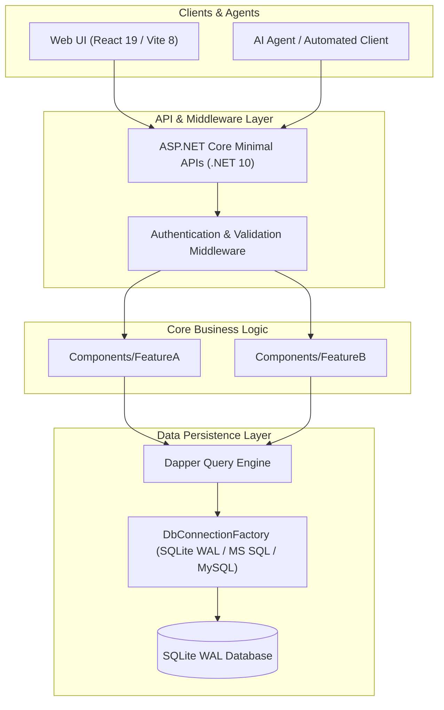
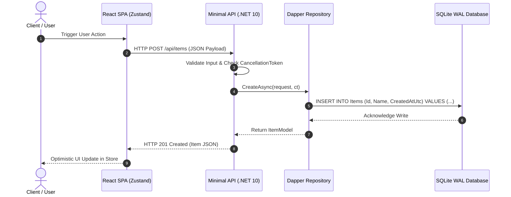

# 🏛️ Architecture: {{PROJECT_NAME}}

This document details the high-level architecture, module boundaries, data flows, and concurrency/security guarantees of **{{PROJECT_NAME}}**.

---

## 🏗️ High-Level System Architecture



---

## 📡 Message & Request Sequence Flow



---

## 🧩 Modular Boundaries & Structure

```text
├── Components/         # Feature vertical slices (Endpoints, Models, Repositories)
├── Infrastructure/     # Persistence (DbConnectionFactory, Seeders), Logging, Transports
├── Core/               # Domain interfaces, Exceptions, Thread-safe State wrappers
└── tests/              # xUnit Unit & Pairwise Integration Tests
```

---

## 📐 Non-Functional Requirements & Design Guarantees

1. **Deterministic Latency**: Sub-millisecond local in-memory queries and WAL database reads.
2. **Concurrency Safety**: Lock-free or `ConcurrentDictionary` state wrappers; `CancellationToken` wired across all async operations.
3. **Data Integrity**: Parameterized SQL queries preventing injection; zero heavy ORM overhead.
4. **UX Ergonomics**: Frontends audited using `playwright-layout-inspector` to guarantee responsive viewport fit without horizontal overflow.
