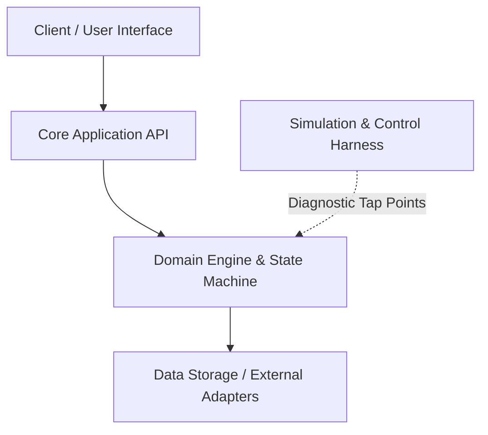

## 🏛️ Architecture Overview

---

## 🚀 Getting Started

1. **Architecture**: Read [System Overview](/architecture) for subsystem topology.
2. **Requirements**: Review [System Requirements](/requirements) for behavioral specifications.
3. **Changelog**: Audit [Changelog](/changelog) for historical version releases.
